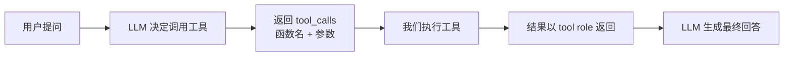
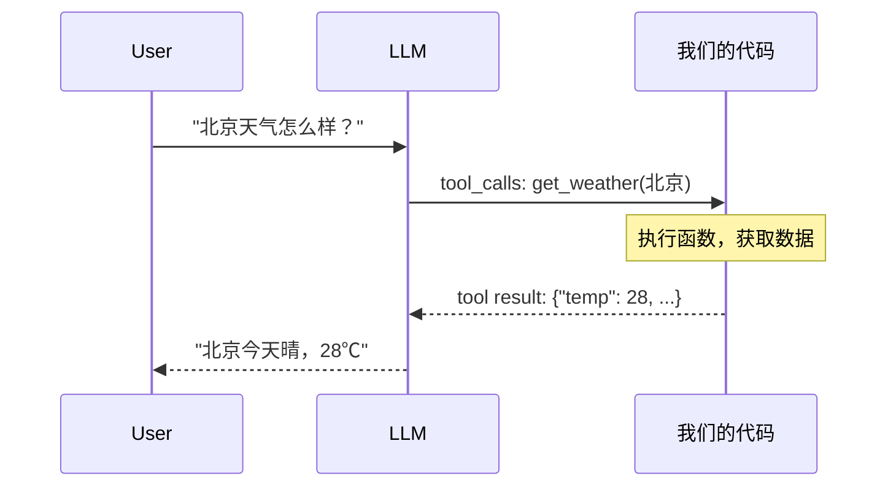

# 01 - Function Calling 机制

## 学习目标

- 理解 Function Calling 的完整流程
- 掌握 tools 参数的 JSON Schema 定义方式
- 学会解析 tool_calls 并返回 tool role 消息
- 理解并行工具调用与循环处理模式

## 运行方式

```bash
python 02_tool_calling/01_function_calling.py
```

---

## 核心概念

### 1. 什么是 Function Calling？

Function Calling 让 LLM 能够**请求调用外部工具**。模型本身不执行任何函数，它只是告诉你："我想调用某个函数，参数是这些"。**真正的执行由我们的代码完成。**



**关键认知：** LLM 是"决策者"，我们是"执行者"。

### 2. 消息角色扩展

在基础对话的 system / user / assistant 之上，Function Calling 引入了两个新角色：

| 角色 | 作用 | 说明 |
|------|------|------|
| `assistant` (带 tool_calls) | LLM 的工具调用请求 | 包含要调用的函数名和参数 |
| `tool` | 工具执行结果 | 必须携带 `tool_call_id` 与请求对应 |

### 3. 完整交互流程



---

## 三个示例详解

### 示例 1：单次工具调用

最基础的 Function Calling 流程：

```python
# 1. 定义工具 Schema
TOOLS = [{
    "type": "function",
    "function": {
        "name": "get_weather",
        "description": "获取指定城市的当前天气信息",
        "parameters": {
            "type": "object",
            "properties": {
                "city": {"type": "string", "description": "城市名称"},
                "unit": {"type": "string", "enum": ["celsius", "fahrenheit"]},
            },
            "required": ["city"],
        },
    },
}]

# 2. 发送给 LLM（传入 tools 参数）
response = client().chat.completions.create(
    model=get_model(),
    messages=messages,
    tools=TOOLS,
)

# 3. 检查是否触发工具调用
msg = response.choices[0].message
if msg.tool_calls:
    for tool_call in msg.tool_calls:
        func_name = tool_call.function.name          # "get_weather"
        func_args = json.loads(tool_call.function.arguments)  # {"city": "北京"}
        result = TOOL_FUNCTIONS[func_name](**func_args)       # 执行

        # 4. 将结果以 tool role 返回
        messages.append({
            "role": "tool",
            "tool_call_id": tool_call.id,  # 必须一一对应！
            "content": result,
        })

# 5. 第二次调用：LLM 基于工具结果生成自然语言回答
final = client().chat.completions.create(model=..., messages=messages, tools=TOOLS)
```

**要点：**
- `tool_call_id` 必须与 `tool_call.id` 严格匹配，否则 API 报错
- `arguments` 是 JSON **字符串**，需要 `json.loads()` 解析
- 工具返回值也必须是字符串（通常用 `json.dumps()`）

### 示例 2：并行工具调用（循环处理）

用户一句话可能需要多个工具协作。模型的行为有两种可能：
- **一次性并行调用**多个工具（理想情况）
- **分多轮逐个调用**（部分模型的行为）

因此必须用**循环**处理：

```python
while True:
    response = client().chat.completions.create(
        model=get_model(), messages=messages, tools=TOOLS,
    )
    msg = response.choices[0].message

    # 没有 tool_calls → 最终回答，退出
    if not msg.tool_calls:
        print(msg.content)
        break

    # 有 tool_calls → 执行所有工具，继续循环
    messages.append(msg)
    for tool_call in msg.tool_calls:
        result = execute_tool(tool_call)
        messages.append({
            "role": "tool",
            "tool_call_id": tool_call.id,
            "content": result,
        })
```

**要点：**
- 这就是 Agent 的核心 **Tool Loop** 模式
- 无论模型一次调 1 个还是 3 个工具，循环都能正确处理
- 退出条件：`msg.tool_calls` 为空（模型认为信息够了，给出最终回答）

### 示例 3：无需工具的情况

并非所有问题都需要工具。当用户说"你好"时，模型会直接回答：

```python
msg = response.choices[0].message

if msg.tool_calls:
    # 走工具调用流程
else:
    # 直接输出 msg.content
```

**要点：**
- 即使传了 `tools` 参数，模型也可以选择不调用
- 模型根据用户意图自主判断是否需要工具

---

## 工具定义 (JSON Schema) 详解

```python
{
    "type": "function",
    "function": {
        "name": "get_weather",           # 函数名（唯一标识）
        "description": "获取天气信息",     # 帮助 LLM 判断何时调用
        "parameters": {                   # JSON Schema 格式
            "type": "object",
            "properties": {
                "city": {
                    "type": "string",
                    "description": "城市名称",  # 越清晰，LLM 提取参数越准
                },
                "unit": {
                    "type": "string",
                    "enum": ["celsius", "fahrenheit"],  # 限定可选值
                },
            },
            "required": ["city"],  # 必填字段
        },
    },
}
```

**最佳实践：**
- `description` 写清楚，这是 LLM 决策的唯一依据
- 用 `enum` 约束参数取值范围
- 用 `required` 区分必填/可选参数
- 可选参数在函数实现中给默认值

---

## tool_choice 参数

可以控制模型的工具调用行为：

| 值 | 行为 |
|------|------|
| `"auto"` (默认) | 模型自主决定是否调用工具 |
| `"none"` | 禁止调用工具，强制文本回答 |
| `"required"` | 必须调用至少一个工具 |
| `{"type": "function", "function": {"name": "xxx"}}` | 强制调用指定函数 |

---

## 实践经验

**Q: 模型不调用工具，反而反问用户怎么办？**
A: 添加 system prompt 引导：
```python
{"role": "system", "content": "当用户的问题匹配可用工具时，直接调用工具，不要反问用户。对于未指定的可选参数，使用合理默认值。"}
```

**Q: 为什么最终回答是 None？**
A: 说明模型返回了 tool_calls 而非文本。必须继续循环处理，直到 `msg.tool_calls` 为空。

**Q: 工具函数应该返回什么格式？**
A: 字符串。推荐 `json.dumps()` 序列化，结构化数据方便 LLM 理解。

**Q: 并行调用时工具执行顺序重要吗？**
A: 同一轮内的多个 tool_calls 彼此独立，可以并行执行（如用 `asyncio`），也可以顺序执行。

---

## 消息结构速查

```python
# 完整的 Function Calling 消息流
messages = [
    {"role": "system", "content": "..."},
    {"role": "user", "content": "北京天气怎么样？"},

    # LLM 返回的工具调用请求 (直接把 message 对象 append)
    # role="assistant", tool_calls=[{id, function: {name, arguments}}]

    # 工具执行结果
    {"role": "tool", "tool_call_id": "call_xxx", "content": '{"temp": 28}'},

    # LLM 最终回答
    # role="assistant", content="北京今天晴，气温28℃"
]
```

---

## 下一步

→ [02 - 自定义工具实现](02_custom_tools.md)
