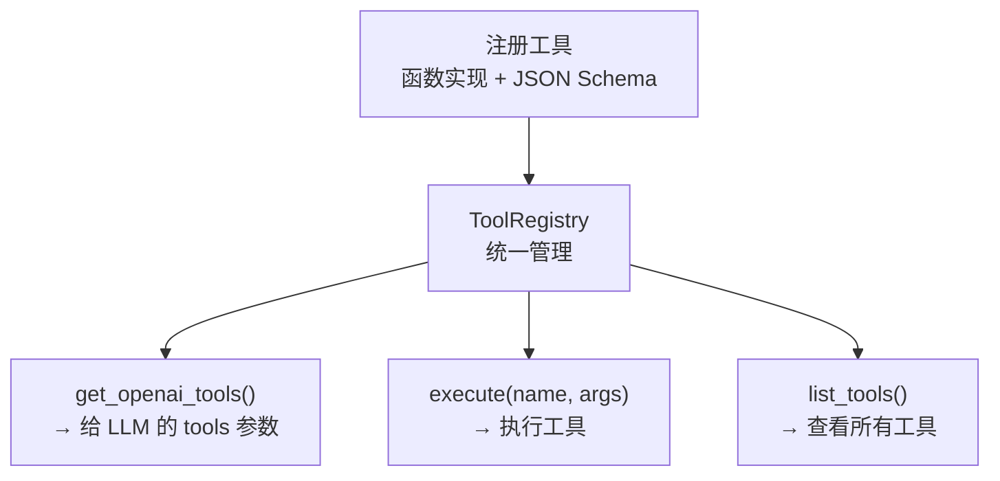

# 02 - 自定义工具实现

## 学习目标

- 掌握工具注册的设计模式（装饰器 + 注册表）
- 实现实用工具：网页搜索、时间查询、数学计算、文件读取
- 学会工具的错误处理与结果格式化
- 理解工具描述（description）对 LLM 调用决策的影响

## 运行方式

```bash
python 02_tool_calling/02_custom_tools.py
```

---

## 核心概念

### 1. 为什么需要工具注册表？

在 01 中我们用字典手动映射工具：

```python
# 01 的方式 - 工具少时够用，但不好维护
TOOL_FUNCTIONS = {"get_weather": get_weather, "calculate": calculate}
TOOLS = [...]  # Schema 单独维护
```

问题：**Schema 定义和函数实现分离**，添加新工具要改两个地方，容易遗漏。

注册表模式将两者绑定在一起：



### 2. 装饰器注册模式

```python
class ToolRegistry:
    def __init__(self):
        self._tools: dict[str, dict] = {}  # name -> {"func", "schema"}

    def register(self, name, description, parameters):
        """装饰器工厂：注册工具"""
        def decorator(func):
            self._tools[name] = {
                "func": func,
                "schema": {
                    "type": "function",
                    "function": {
                        "name": name,
                        "description": description,
                        "parameters": parameters,
                    },
                },
            }
            return func  # 原函数不变
        return decorator
```

使用方式极其简洁——**一个装饰器完成注册**：

```python
registry = ToolRegistry()

@registry.register(
    name="get_current_time",
    description="获取当前日期和时间信息",
    parameters={
        "type": "object",
        "properties": {
            "timezone": {"type": "string", "description": "时区"},
        },
        "required": [],
    },
)
def get_current_time(timezone: str = "") -> str:
    ...
```

添加新工具 = 写一个函数 + 加一个装饰器，无需修改其他代码。

### 3. 统一执行与错误处理

```python
def execute(self, name: str, arguments: dict) -> str:
    if name not in self._tools:
        return json.dumps({"error": f"未知工具: {name}"})
    try:
        result = self._tools[name]["func"](**arguments)
        return result if isinstance(result, str) else json.dumps(result, ensure_ascii=False)
    except Exception as e:
        return json.dumps({"error": f"工具执行失败: {str(e)}"}, ensure_ascii=False)
```

**设计原则：**
- 永远返回字符串（LLM 的 tool message 要求 content 为 string）
- 永远不抛异常（错误也作为结构化结果返回，让 LLM 自行处理）
- 错误信息用 JSON 格式，LLM 能理解并给用户有意义的反馈

---

## 四个工具实现详解

### 工具 1：web_search（网页搜索）

```python
@registry.register(name="web_search", description="搜索互联网获取实时信息...")
def web_search(query: str, max_results: int = 3) -> str:
    from ddgs import DDGS
    results = DDGS().text(query, max_results=max_results)
    # 格式化返回: title / snippet / url
```

**要点：**
- 使用 `ddgs` 包（原 `duckduckgo_search`，已更名）
- 延迟导入（`from ddgs import DDGS` 放在函数内），避免未安装时整个脚本崩溃
- 区分 `ImportError`（依赖缺失）和网络异常，给出不同提示

### 工具 2：get_current_time（时间查询）

```python
@registry.register(name="get_current_time", description="获取当前日期和时间信息")
def get_current_time(timezone: str = "") -> str:
    now = datetime.now()
    return json.dumps({
        "datetime": now.strftime("%Y-%m-%d %H:%M:%S"),
        "weekday": ["周一", ...][now.weekday()],
    })
```

**要点：**
- 无必填参数（`"required": []`），LLM 可以直接空调用
- LLM 无法获取实时信息，时间类工具是最常见的 Agent 工具之一

### 工具 3：math_calculator（数学计算）

```python
@registry.register(name="math_calculator", description="执行高级数学计算...")
def math_calculator(operation: str, x: float, y: float = 0) -> str:
    ops = {
        "sin": lambda: math.sin(math.radians(x)),
        "sqrt": lambda: math.sqrt(x),
        "power": lambda: x ** y,
        ...
    }
    result = ops[operation]()
```

**要点：**
- 用 `enum` 约束 operation 取值，LLM 不会传无效值
- 三角函数用 `math.radians()` 转换（LLM 传的是角度制）
- 策略模式：字典映射 operation → lambda，扩展新运算只需加一行

### 工具 4：read_file（文件读取）

```python
@registry.register(name="read_file", description="读取本地文件内容...")
def read_file(file_path: str, max_lines: int = 50) -> str:
    project_root = Path(__file__).resolve().parent.parent
    target = (project_root / file_path).resolve()

    # 安全检查: 防止路径穿越 (../../etc/passwd)
    if not str(target).startswith(str(project_root)):
        return json.dumps({"error": "安全限制: 不能读取项目目录外的文件"})
```

**要点：**
- **路径穿越防护**是文件操作工具的必备安全措施
- `resolve()` 解析 `..` 后再检查前缀，防止 `../../etc/passwd` 攻击
- `max_lines` 限制返回量，避免超大文件撑爆 token

---

## 工具描述的最佳实践

工具描述（description）是 LLM 决策的**唯一依据**，质量直接影响调用准确性：

| 维度 | 差的写法 | 好的写法 |
|------|----------|----------|
| 能力 | "计算" | "执行高级数学计算，支持三角函数、对数、幂运算等" |
| 适用条件 | （无） | "适用于需要精确数学计算的场合" |
| 排除条件 | （无） | "不适合简单加减法" |
| 参数说明 | "数字" | "输入数值，三角函数时为角度制（如 30 表示 30°）" |

**四原则：**
1. 说明工具**能做什么**（能力边界）
2. 说明**什么场景该用**（触发条件）
3. 说明**什么场景不该用**（避免误调用）
4. 参数描述要**具体**，给出示例值和单位

---

## 架构对比

| 对比维度 | 手动映射（01_function_calling.py） | 注册表模式（02_custom_tools.py） |
| :--- | :--- | :--- |
| 结构 | `TOOLS = [schema...]` 与 `TOOL_FUNCTIONS = {...}` **分离** | `@registry.register()`，schema + func **一体绑定** |
| 添加新工具 | 改两处 | 加一个装饰器 |
| 适合场景 | 2-3 个工具的简单场景 | 工具多、需动态管理 |

---

## 实践经验

**Q: 为什么工具函数要返回 JSON 字符串而不是 dict？**
A: OpenAI API 要求 tool message 的 `content` 必须是 string。用 `json.dumps()` 序列化，结构化数据方便 LLM 解析。

**Q: 为什么错误不能直接 raise？**
A: 如果工具执行抛异常，整个对话流程就中断了。把错误作为正常结果返回，LLM 可以告诉用户"搜索失败了"或自动尝试其他方案。

**Q: 装饰器注册和 LangChain 的 @tool 有什么区别？**
A: 原理相同。LangChain 的 `@tool` 自动从函数签名和 docstring 生成 Schema；我们的手动版更显式，适合学习理解底层机制。

**Q: 工具数量很多时，全部传给 LLM 会有问题吗？**
A: 会。工具太多会占用大量 token、降低选择准确率。实践中可以：按场景分组、动态筛选相关工具、使用两级路由。

---

## 下一步

→ [03 - 工具调用循环](03_tool_loop.md)
