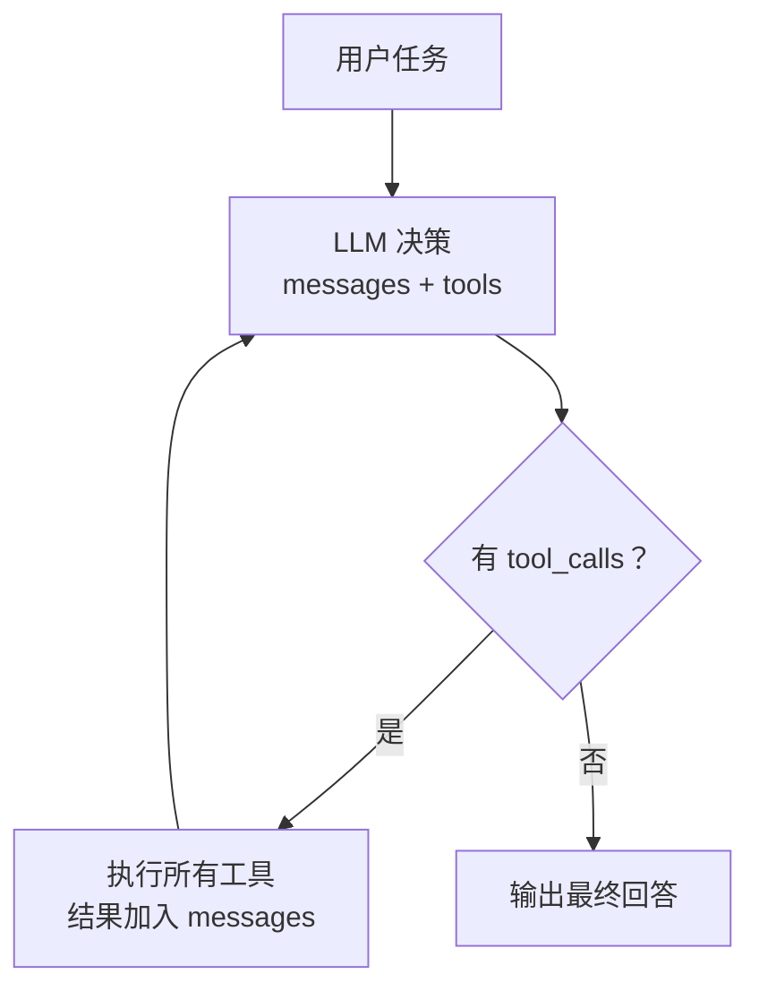
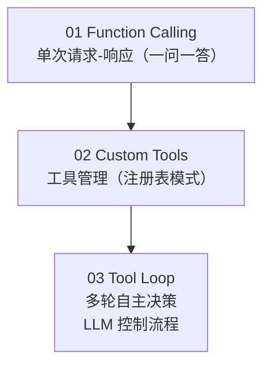
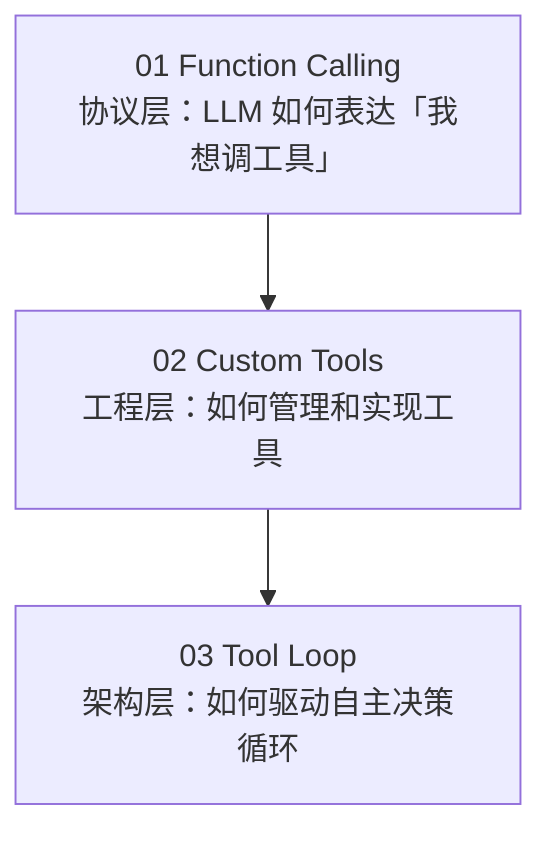

# 03 - 工具调用循环（Agent 核心）

## 学习目标

- 实现完整的 Agent Loop：决策 → 调用 → 观察 → 继续
- 理解这是所有 Agent 框架（LangChain / LangGraph / AutoGen）的底层原理
- 掌握循环终止条件与最大迭代保护
- 实现一个可交互的命令行 Agent

## 运行方式

```bash
python 02_tool_calling/03_tool_loop.py
```

---

## 核心概念

### 1. Agent 的本质公式

```
Agent = LLM（大脑） + Tools（手脚） + Loop（决策循环）
```

LLM 本身只能生成文本。但通过循环调用工具，它获得了**感知环境**和**影响环境**的能力——这就是 Agent。

### 2. Agent Loop 伪代码

```python
while True:
    response = LLM(messages, tools)

    if response 包含 tool_calls:
        执行工具，将结果加入 messages
        continue  # LLM 看到结果后决定下一步
    else:
        输出最终回答
        break
```



就这么简单。**所有 Agent 框架的底层都是这个循环**，区别只在于：
- 工具更丰富（代码执行、数据库、API...）
- 循环更复杂（分支、并行、人工审批...）
- 记忆更持久（向量数据库、文件系统...）

### 3. 与前两课的关系



---

## agent_loop 函数详解

这是整个项目**最重要的函数**：

```python
def agent_loop(user_message, system_prompt="", max_iterations=10, verbose=True) -> str:
    messages = [system_prompt, user_message]

    for iteration in range(max_iterations):
        # 1. 调用 LLM
        response = LLM(messages, tools)
        msg = response.choices[0].message

        # 2. 终止条件：没有 tool_calls → 最终回答
        if not msg.tool_calls:
            return msg.content

        # 3. 执行工具
        messages.append(msg)  # assistant 消息（含 tool_calls）
        for tool_call in msg.tool_calls:
            result = execute_tool(tool_call)
            messages.append({"role": "tool", "tool_call_id": ..., "content": result})

        # 4. 继续循环 → LLM 看到工具结果，决定下一步

    return "[达到最大迭代次数，强制停止]"
```

### 关键设计决策

| 设计 | 原因 |
|------|------|
| `for` 而非 `while True` | 防止无限循环（LLM 可能陷入反复调用） |
| `max_iterations=10` | 经验值，复杂任务 5-8 轮足够 |
| 工具错误不抛异常 | LLM 看到错误信息后可以自我修正 |
| `verbose` 参数 | 调试时看中间过程，生产时静默 |

---

## 运行示例分析

输入："帮我查一下 Python 最新版本号，然后计算该版本号乘以 2 的结果，并把结论记为笔记"

```
迭代 1: search("Python 最新版本号")     ← LLM 决定先搜索
迭代 2: calculate("3.11.0*2")           ← 失败！版本号不是合法数字
迭代 3: search("Python 3.11 版本号")    ← LLM 自我修正，重新搜索
迭代 4: calculate("3.11.0*2")           ← 又失败
迭代 5: search(...)                     ← 再次尝试
迭代 6: calculate("3.11*2") → 6.22     ← 终于修正为合法表达式 ✓
迭代 7: take_note(...)                  ← 记录笔记 ✓
迭代 8: 最终回答                        ← 无 tool_calls，循环结束
```

**观察要点：**
- LLM **自主规划**了多步任务（搜索 → 计算 → 记录）
- 遇到错误后**自我纠错**（`3.11.0` → `3.11`）
- 我们没写任何 if-else 流程控制，全靠 LLM 决策

---

## 五个工具的设计

| 工具 | 类型 | 说明 |
|------|------|------|
| `search` | 信息获取 | Bing 搜索，httpx + BeautifulSoup 解析 |
| `calculate` | 精确计算 | 安全 eval，限制可用函数 |
| `get_time` | 环境感知 | LLM 无法获取实时信息 |
| `take_note` | 状态写入 | 内存存储，模拟"记忆"能力 |
| `recall_notes` | 状态读取 | 配合 take_note 实现简单记忆 |

**工具分类思维：**
- **读取型**（search、get_time、recall_notes）：获取信息
- **写入型**（take_note）：改变环境状态
- **计算型**（calculate）：弥补 LLM 数学弱点

---

## System Prompt 的作用

```python
SYSTEM_PROMPT = """你是一个智能助手 Agent。你可以搜索信息、进行计算、记录笔记。

工作原则:
1. 需要外部信息时，主动使用搜索工具
2. 需要精确计算时，使用计算工具而不是心算
3. 重要信息用笔记工具记录
4. 综合所有工具结果给出完整回答
"""
```

System Prompt 定义了 Agent 的**行为准则**：
- 告诉 LLM 有哪些能力（工具列表的补充说明）
- 引导 LLM 的行为模式（主动搜索、精确计算、记录笔记）
- 没有它，LLM 可能"偷懒"直接编造答案而不调工具

---

## 与 Agent 框架的对应关系

```
我们的实现                    框架对应
─────────────────────────────────────────────
agent_loop()              →  LangGraph 的 StateGraph
TOOLS + TOOL_MAP          →  LangChain 的 Tool / ToolKit
messages 列表             →  Agent 的 State（状态）
max_iterations            →  LangGraph 的 recursion_limit
system_prompt             →  Agent 的 Instructions
tool 返回错误 + LLM 重试  →  ReAct 模式的 Observation → Thought
```

理解了 `agent_loop()`，就理解了 90% 的 Agent 框架源码。

---

## 实践经验

**Q: 为什么用 `for range(max_iterations)` 而不是 `while True`？**
A: LLM 可能陷入死循环（比如反复搜索同一个东西）。`max_iterations` 是安全阀，生产环境必须设置。

**Q: 工具执行失败怎么办？**
A: 不要抛异常，把错误信息作为正常结果返回。LLM 看到 `"error": "计算失败: invalid syntax"` 后，通常会自我修正参数重试。

**Q: 多轮对话怎么实现？**
A: 在 `agent_loop` 外层再包一个循环，把每轮的 messages 历史累积起来（参见 `demo_interactive`）。

**Q: 如何控制 token 成本？**
A: 每轮迭代都发送完整 messages，工具结果越多 token 越贵。可以：截断过长的工具结果、限制搜索返回条数、对历史消息做摘要。

**Q: 这个循环和 ReAct 模式是什么关系？**
A: 本质相同。ReAct（Reasoning + Acting）= Thought（LLM 思考）+ Action（tool_calls）+ Observation（工具结果）。我们的循环就是 ReAct 的最简实现。

---

## 阶段 2 总结



**核心认知：Agent = LLM(大脑) + Tools(手脚) + Loop(决策循环)**

---

## 下一步

→ 03_agent_patterns/ - 经典 Agent 设计模式（ReAct、Plan-and-Execute、Multi-Agent）
