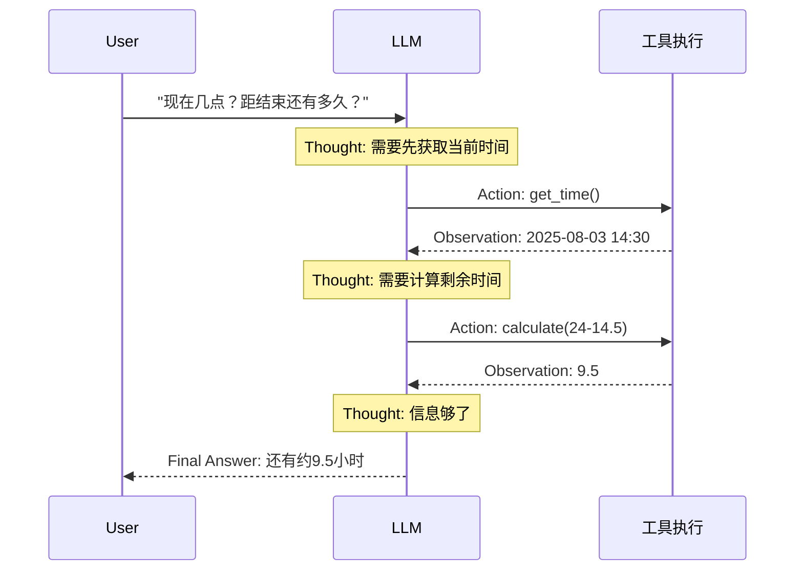

# 01 - ReAct 模式 (Reasoning + Acting)

## 学习目标

- 理解 ReAct 论文的核心思想：推理与行动交替进行
- 手动实现一个不依赖框架的 ReAct Agent
- 掌握 Thought → Action → Observation 循环
- 理解 ReAct 相比纯工具循环的优势（可解释性）

## 运行方式

```bash
python 03_agent_patterns/01_react.py
```

---

## 核心概念

### 1. 什么是 ReAct？

ReAct = **Re**asoning + **Act**ing，源自 2022 年论文 *"ReAct: Synergizing Reasoning and Acting in Language Models"*。

传统工具循环中，LLM 直接决定调用什么工具，是一个**黑盒**决策过程。ReAct 的核心改变是让 LLM **先说出自己的思考**，再决定行动：

```
传统工具循环:  用户提问 → LLM 直接调工具 → 拿结果 → 回答 (黑盒)
ReAct:        用户提问 → Thought → Action → Observation → Thought → ... → Final Answer
```

**关键认知：** ReAct 本质上是把 LLM 的"内心独白"显式化了。推理过程变成了可见的文本，而非隐藏在模型权重里的隐式决策。

### 2. Thought-Action-Observation 循环

每一轮循环包含三个阶段：

| 阶段 | 产出者 | 作用 |
|------|--------|------|
| **Thought** | LLM | 分析当前状况，决定下一步做什么，解释*为什么*选择这个工具 |
| **Action** | LLM | 选择一个工具并给出参数 |
| **Observation** | 代码执行 | 工具返回的结果，反馈给 LLM 继续推理 |



### 3. ReAct vs 传统工具循环

| 对比维度 | 传统工具循环 (阶段2) | ReAct |
|----------|----------------------|-------|
| 决策方式 | LLM 直接输出 `tool_calls` | LLM 先输出 Thought 文本，再输出 Action |
| 可解释性 | 低（黑盒） | 高（每步推理可见） |
| 实现方式 | 依赖 API 的 tool_calls 机制 | 文本解析（正则/字符串匹配） |
| 调试难度 | 较难（只能看到工具调用结果） | 较易（能看到 Agent 为什么这么做） |
| Token 消耗 | 较少 | 较多（Thought 占用额外 token） |
| 适用场景 | 简单工具调用 | 需要多步推理、可追溯的复杂任务 |

---

## 代码实现详解

### 工具定义

本例定义了三个工具，覆盖搜索、计算、时间查询：

```python
TOOLS = [
    {"type": "function", "function": {"name": "search", ...}},      # 搜索互联网
    {"type": "function", "function": {"name": "calculate", ...}},   # 数学计算
    {"type": "function", "function": {"name": "get_time", ...}},    # 获取当前时间
]
```

**注意：** 这里的 `TOOLS` 定义虽然保留了 OpenAI function calling 的 JSON Schema 格式，但 ReAct 实际上**不使用** API 的 `tool_calls` 机制。工具信息是写在 system prompt 里告诉 LLM 的，LLM 通过**纯文本**输出工具名和参数。

### 工具执行

```python
def execute_tool(name: str, args: dict) -> str:
    if name == "search":
        # 使用 httpx + BeautifulSoup 爬取必应搜索结果
        # 返回前3条结果的标题和摘要
    elif name == "calculate":
        # 安全 eval：限制可用函数白名单，禁用 __builtins__
        allowed = {"abs": abs, "round": round, "sqrt": math.sqrt, ...}
        result = eval(args["expression"], {"__builtins__": {}}, allowed)
    elif name == "get_time":
        # 返回当前日期时间和星期几
```

**安全要点：** `calculate` 工具使用了受限的 `eval`——将 `__builtins__` 设为空字典，只允许白名单内的函数。这是一种基础的安全措施，防止执行危险代码。

### System Prompt 设计

System Prompt 是 ReAct 的灵魂，它定义了 LLM 的输出格式：

```
Thought: [思考过程]
Action: [工具名称]
Action Input: [工具参数, JSON 格式]

--- 或 ---

Thought: [总结思考]
Final Answer: [最终回答]
```

**设计要点：**
1. **格式约束** — 明确要求 LLM 按 Thought/Action/Action Input 格式输出，便于代码解析
2. **示例引导** — 给出了完整的 few-shot 示例，展示多步推理过程
3. **规则限制** — 每次只输出一个 Thought + Action 对，不编造工具结果

### 核心循环实现

```python
def react_agent(user_question: str, max_steps: int = 10) -> str:
    messages = [
        {"role": "system", "content": REACT_SYSTEM_PROMPT},
        {"role": "user", "content": user_question},
    ]

    for step in range(max_steps):
        # 1. 调用 LLM（不使用 tools 参数！）
        response = client().chat.completions.create(
            model=get_model(),
            messages=messages,
            temperature=0,  # 确定性输出，减少格式波动
        )
        llm_output = response.choices[0].message.content

        # 2. 检查是否完成
        if "Final Answer:" in llm_output:
            answer = llm_output.split("Final Answer:")[-1].strip()
            return answer

        # 3. 文本解析：提取 Action 和 Action Input
        action, action_input = None, None
        for line in llm_output.split("\n"):
            if line.startswith("Action:"):
                action = line.replace("Action:", "").strip()
            elif line.startswith("Action Input:"):
                action_input = json.loads(line.replace("Action Input:", "").strip())

        # 4. 执行工具，将结果作为 Observation 返回
        if action and action_input is not None:
            observation = execute_tool(action, action_input)
            messages.append({"role": "user", "content": f"Observation: {observation}\n\n请继续推理..."})
        else:
            # 格式不对，提示重试
            messages.append({"role": "user", "content": "请按照格式输出..."})
```

**与阶段2工具循环的关键区别：**
- 调用 `chat.completions.create()` 时**不传 `tools` 参数**
- LLM 的输出是**纯文本**（不是结构化的 `tool_calls`）
- 通过**字符串解析**提取 Action 和 Action Input
- Observation 以 `user` 角色消息返回（不是 `tool` 角色）

---

## 消息流转结构

```python
messages = [
    {"role": "system", "content": REACT_SYSTEM_PROMPT},     # 格式指令
    {"role": "user",   "content": "用户问题"},               # 初始问题

    # --- 第1轮 ---
    {"role": "assistant", "content": "Thought: ...\nAction: get_time\nAction Input: {}"},
    {"role": "user",      "content": "Observation: {...}\n\n请继续推理"},

    # --- 第2轮 ---
    {"role": "assistant", "content": "Thought: ...\nAction: calculate\nAction Input: {...}"},
    {"role": "user",      "content": "Observation: {result: 9.5}\n\n请继续推理"},

    # --- 第3轮 ---
    {"role": "assistant", "content": "Thought: ...\nFinal Answer: 还有约9.5小时"},
]
```

**注意：** Observation 使用 `user` 角色而非 `tool` 角色，因为 ReAct 不依赖 OpenAI 的工具调用 API，而是纯文本交互。

---

## 实践经验

**Q: 为什么 `temperature=0`？**
A: ReAct 需要 LLM 按固定格式输出，温度越低，格式越稳定。高温度容易导致格式混乱，解析失败。

**Q: LLM 不按规定格式输出怎么办？**
A: 常见策略：
1. 在 system prompt 中给出清晰的 few-shot 示例
2. 解析失败时，追加一条提示消息要求重新按格式输出
3. 使用更强的模型（GPT-4 比 GPT-3.5 格式遵从性好得多）

**Q: `max_steps` 为什么重要？**
A: 防止 Agent 陷入无限循环。没有上限的话，LLM 可能反复调用工具却无法得出结论。实际项目中通常设为 10-15。

**Q: ReAct 的主要缺点是什么？**
A:
- **Token 消耗大** — 每轮 Thought 都是额外 token，多步推理后上下文快速膨胀
- **延迟高** — 每步都需要一次 LLM 调用，串行执行
- **格式脆弱** — 依赖文本解析，模型偶尔会输出不符合格式的内容

---

## 知识脉络

```
阶段1: 基础对话 (LLM 直接回答)
  ↓
阶段2: 工具循环 (LLM 通过 tool_calls 调工具，黑盒决策)
  ↓
阶段3 本课: ReAct (LLM 先思考再行动，白盒推理)
  ↓
下一课: Plan-and-Execute (先规划完整计划，再逐步执行)
```

ReAct 是 Agent 模式的基础范式。后续的 Plan-and-Execute、Reflection 等模式都是在 ReAct 的思想上的扩展和变体。

---

## 下一步

→ [02 - Plan-and-Execute 模式](02_plan_and_execute.md)
