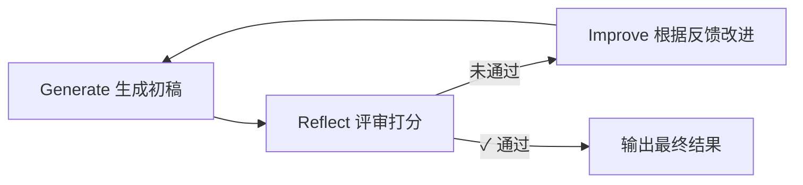

# 03 - Reflection 自我反思模式

## 学习目标

- 理解 Reflection 模式的核心：生成 → 评估 → 改进的迭代循环
- 实现 Generator（生成器）+ Reflector（反思器）双角色架构
- 掌握如何用 LLM 评估和改进自己的输出
- 理解 Reflection 在提升输出质量中的作用

## 运行方式

```bash
python 03_agent_patterns/03_reflection.py
```

---

## 核心概念

### 1. 什么是 Reflection？

Reflection（自我反思）模式模拟了人类"写了改、改了再写"的创作过程。核心思想极其简单：**让 LLM 自己批评自己**。

```
单次生成:   用户提问 → LLM 回答 → 结束 (质量取决于一次生成)
Reflection: 用户提问 → LLM 生成 → LLM 反思 → LLM 改进 → LLM 再反思 → ... → 最终输出
```

**关键认知：** 同一个 LLM，通过扮演不同角色（生成者 vs 批评者），可以显著提升输出质量。这不是因为模型"变聪明了"，而是因为**分步处理降低了任务难度**——"写一篇好文章"比"一次性写出完美文章"容易得多。

### 2. Generate-Reflect-Improve 循环



| 角色 | 职责 | System Prompt 关键特征 |
|------|------|------------------------|
| **Generator** | 根据要求生成内容 | "你是一个写作助手" — 侧重创造 |
| **Reflector** | 从多个维度评估内容 | "你是一个严格的评审专家" — 侧重批判 |
| **Improver** | 根据反馈改进内容 | "请根据评审反馈改进" — 侧重修正 |

**注意：** 三个角色使用的是**同一个 LLM**，只是通过不同的 system prompt 赋予不同的"人格"。

### 3. 三种 Agent 模式对比

到这里我们已经学了三种 Agent 模式，它们解决的问题维度完全不同：

| 对比维度 | ReAct | Plan-and-Execute | Reflection |
|----------|-------|------------------|------------|
| 核心思想 | 推理 + 行动 | 先规划后执行 | 生成 + 反思 |
| 循环结构 | Thought → Action → Observation | Plan → Execute → Replan | Generate → Reflect → Improve |
| 主要目标 | 解决问题（找到答案） | 完成任务（执行多步） | 提升质量（迭代优化） |
| 适合场景 | 问答、搜索、计算 | 研究报告、复杂分析 | 写作、代码、创意内容 |
| 关键组件 | 工具调用 | 规划器 + 执行器 | 反思器 |
| 输出特点 | 答案 | 结构化报告 | 高质量内容 |

---

## 代码实现详解

### 三个核心函数

整个 Reflection Agent 由三个独立函数组成，职责清晰：

#### 1. `generate()` — 生成初稿

```python
def generate(initial_prompt: str) -> str:
    response = client().chat.completions.create(
        model=get_model(),
        messages=[
            {"role": "system", "content": GENERATOR_PROMPT},  # "你是一个写作助手"
            {"role": "user", "content": initial_prompt},
        ],
    )
    return response.choices[0].message.content
```

最简单的函数——接收用户要求，直接生成内容。`GENERATOR_PROMPT` 强调内容要有深度、结构清晰、逻辑连贯。

#### 2. `reflect()` — 评审打分

```python
def reflect(content: str, original_prompt: str) -> dict:
    response = client().chat.completions.create(
        model=get_model(),
        messages=[
            {"role": "system", "content": REFLECTOR_PROMPT},  # "你是一个严格的评审专家"
            {"role": "user", "content": f"原始要求:\n{original_prompt}\n\n待评审作品:\n{content}"},
        ],
    )
    review = response.choices[0].message.content

    # 简单解析：检查是否包含 "pass"
    passed = "pass" in review.lower() and "fail" not in review.lower()

    return {"review": review, "passed": passed}
```

**评审维度设计：**
- 内容质量：是否切题、有深度、信息准确
- 结构逻辑：是否条理清晰、层次分明
- 表达质量：是否语言流畅、用词精准
- 完整性：是否覆盖了所有要求

**输出格式：** 要求 Reflector 输出评分（1-10）、优点、改进建议、是否通过。其中"是否通过"是循环的终止条件。

**解析通过状态：** 使用简单的字符串匹配 `"pass" in review.lower()`。这是一种脆弱的实现方式，但对于演示目的足够。

#### 3. `improve()` — 根据反馈改进

```python
def improve(content: str, feedback: str, original_prompt: str) -> str:
    response = client().chat.completions.create(
        model=get_model(),
        messages=[
            {"role": "system", "content": "你是一个写作助手。请根据评审反馈改进你的作品。"},
            {"role": "user", "content": f"""原始要求:
{original_prompt}

你的初稿:
{content}

评审反馈:
{feedback}

请根据反馈进行改进，输出改进后的完整作品。"""},
        ],
    )
    return response.choices[0].message.content
```

**关键设计：** `improve()` 同时接收三个输入——原始要求、当前内容、评审反馈。这让 LLM 知道：
1. 最初要做什么（不偏离目标）
2. 现在是什么状态（知道起点）
3. 哪里需要改（明确改进方向）

### 主循环：reflection_agent

```python
def reflection_agent(prompt: str, max_iterations: int = 3) -> dict:
    history = []

    # 步骤1: 生成初始内容
    current_content = generate(prompt)
    history.append({"iteration": 1, "content": current_content, "action": "generate"})

    # 步骤2-4: 反思-改进循环
    for iteration in range(2, max_iterations + 1):
        # 反思
        review_result = reflect(current_content, prompt)
        history.append({"iteration": iteration, "action": "reflect", "review": ...})

        # 检查是否通过
        if review_result["passed"]:
            break

        # 改进
        current_content = improve(current_content, review_result["review"], prompt)
        history.append({"iteration": iteration, "content": current_content, "action": "improve"})

    return {"final_content": current_content, "history": history, "iterations": ...}
```

**循环逻辑：**
1. 先生成初稿（必定执行）
2. 进入反思-改进循环
3. 退出条件：**评审通过** 或 **达到最大迭代次数**

**返回值结构：**
```python
{
    "final_content": "最终内容",
    "history": [                      # 完整的迭代历史
        {"iteration": 1, "action": "generate", "content": "..."},
        {"iteration": 2, "action": "reflect",  "review": "..."},
        {"iteration": 2, "action": "improve",  "content": "..."},
        ...
    ],
    "iterations": 2                   # 实际迭代次数
}
```

---

## 完整执行流程示例

```
任务: "写一段关于'为什么程序员应该学习 AI Agent 开发'的短文，200字左右"

=== 第1轮: 生成 ===
[Generator 输出]:
"AI Agent 开发是当下最值得关注的技术方向之一..."

=== 第2轮: 反思 ===
[Reflector 输出]:
评分: 6/10
优点: 结构清晰，提到了关键概念
改进建议: 1) 缺少具体案例支撑  2) 没有说明对程序员职业发展的影响
是否通过: fail

=== 第2轮: 改进 ===
[Improver 输出]:
"在 ChatGPT 帮助程序员30分钟完成重构的今天..." (加入了具体案例)

=== 第3轮: 反思 ===
[Reflector 输出]:
评分: 8/10
优点: 案例生动，论证有力，结构完整
是否通过: pass

✓ 评审通过！输出最终作品
```

---

## 设计模式深度分析

### 1. 角色分离的价值

为什么不让一个 prompt 同时完成"生成+自我反思"？

```
❌ 单 prompt: "请写一段文章，然后自己检查并改进"
   → LLM 倾向于一次性输出"完美"版本，反思流于形式

✅ 分角色: 先生成 → 独立评审 → 独立改进
   → 每个步骤有明确的注意力焦点，效果更好
```

这类似于软件工程中的**关注点分离**原则。每个函数只做一件事：
- `generate()` 只管生成
- `reflect()` 只管评估
- `improve()` 只管改进

### 2. 迭代终止条件

```python
if review_result["passed"]:
    break  # 评审通过，退出循环
```

两种退出路径：
- **质量达标** — Reflector 给出 pass，提前退出
- **达到上限** — `max_iterations` 防止无限循环

**为什么需要上限？** LLM 的自我反思存在"天花板效应"——改进几轮后，质量提升趋于平缓，甚至可能在某些维度上退步（改好了 A 却改坏了 B）。

### 3. 历史记录的价值

`history` 记录了完整的迭代过程，这不仅用于调试，更重要的是：
- 分析每轮改进的方向和幅度
- 理解 Reflector 关注哪些维度
- 发现 Generator 的常见弱点

---

## 实践经验

**Q: 为什么 Reflector 通常比 Generator 需要更强的模型？**
A: 批评比创造难。评估质量需要全面理解要求和标准，如果 Reflector 能力不够，给出的反馈会流于表面（"写得不错"），无法指导改进。实践中 Reflector 用 GPT-4，Generator 可以用 GPT-3.5。

**Q: `max_iterations` 设多少合适？**
A: 通常 2-3 轮就够了。超过 3 轮后改进效果递减，且 token 消耗线性增长。如果 3 轮后仍无法通过，说明任务本身可能超出了模型能力。

**Q: 如何判断 pass/fail 更可靠？**
A: 当前实现用字符串匹配 `"pass" in review.lower()`，容易被误触发（比如"not pass"）。更可靠的方式：
1. 使用结构化输出（`response_format={"type": "json_object"}`），让 Reflector 输出 `{"passed": true/false}`
2. 用数值评分阈值：`score >= 7` 视为通过

**Q: Reflection 能用于非文本任务吗？**
A: 可以。只要输出可以被评估，就能用 Reflection。例如：
- 代码生成 → Reflector 运行测试用例来评估
- 数据提取 → Reflector 校验提取结果的完整性
- 翻译 → Reflector 检查术语一致性

**Q: Reflection 和 ReAct/Plan-and-Execute 能组合吗？**
A: 完全可以，而且实际系统经常组合使用：
- **ReAct + Reflection** — 推理过程中加入自我反思，检查推理是否合理
- **Plan-and-Execute + Reflection** — 执行完成后反思计划质量，为下次任务积累经验
- **Reflection + Reflection** — 对 Reflector 的反馈再做反思（元反思），确保反馈质量

---

## 知识脉络

```
01_react: ReAct 模式 (逐步推理，解决问题)
  ↓
02_plan_and_execute: Plan-and-Execute (全局规划，完成任务)
  ↓
03_reflection 本课: Reflection (自我反思，提升质量)
  ├── 核心创新: Generator + Reflector 角色分离
  ├── 关键技术: 迭代式改进循环
  └── 适用场景: 写作、代码、任何可评估的输出
  ↓
下一课: 04_memory.py - 记忆机制
```

---

## 下一步

→ [04 - 记忆机制](04_memory.md)
