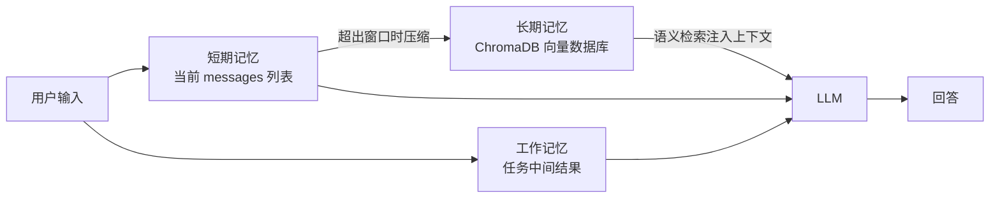
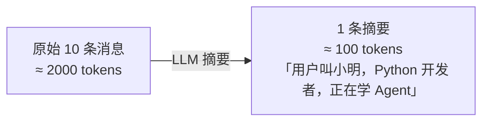
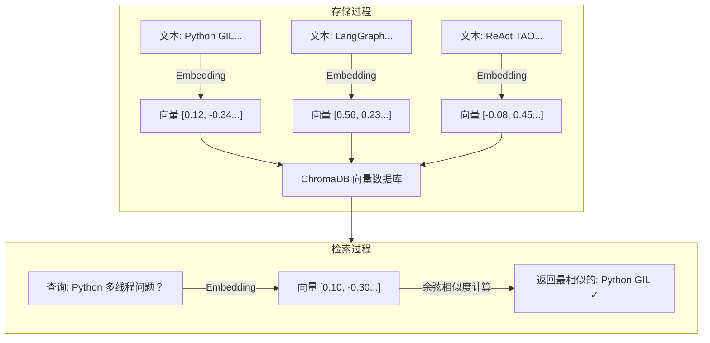
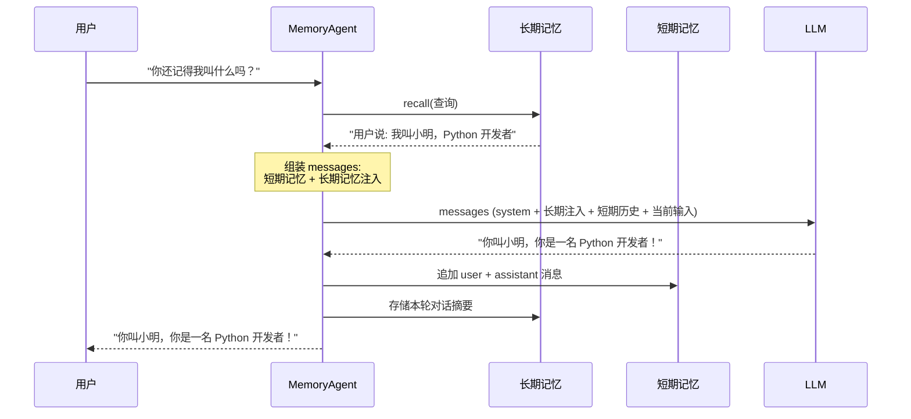
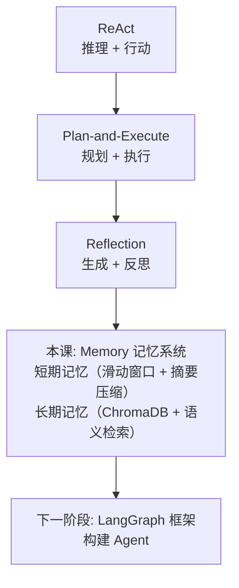

# 04 - 记忆机制（短期 / 长期 / 向量）

## 学习目标

- 理解 Agent 记忆系统的三种类型
- 实现短期记忆（对话历史管理）
- 实现长期记忆（向量数据库存储与检索）
- 掌握 ChromaDB 的基本使用
- 理解记忆对 Agent 持续学习的重要性

## 运行方式

```bash
python 03_agent_patterns/04_memory.py
```

---

## 核心概念

### 1. 为什么需要记忆？

LLM 本身是**无状态**的——每次调用都是一张白纸。它不记得上一轮对话说了什么，也不知道之前发生过什么。所有的"记忆"都是通过 `messages` 列表手动注入的。

```
没有记忆的 Agent:
  用户: "我叫小明"  →  Agent: "你好小明！"
  用户: "我叫什么？" →  Agent: "我不知道你的名字。"  ← 因为 LLM 不记得了

有记忆的 Agent:
  用户: "我叫小明"  →  Agent: "你好小明！"  [记忆已存储]
  用户: "我叫什么？" →  Agent: "你叫小明啊！"  ← 从记忆中检索到了
```

**关键认知：** 记忆系统的本质是**在 LLM 调用之外维护状态**，并在需要时注入上下文。没有记忆，Agent 就只是一次性工具；有了记忆，Agent 才能成为持续协作的伙伴。

### 2. 三种记忆类型

| 维度 | 短期记忆 (Short-term) | 长期记忆 (Long-term) | 工作记忆 (Working/Scratch) |
| :--- | :--- | :--- | :--- |
| 存储内容 | 当前对话历史；messages 列表 | 向量数据库；持久化存储 | 当前任务的临时数据；中间结果、草稿 |
| 特点 | 容量有限；自动裁剪；会话级 | 容量大；语义检索；跨会话 | 任务结束后清空；任务级；如 ReAct 的 scratchpad |

| 类型 | 类比 | 存储方式 | 生命周期 | 本例实现 |
|------|------|----------|----------|----------|
| **短期记忆** | 工作台上的便签 | `messages` 列表 | 当前对话 | `ShortTermMemory` 类 |
| **长期记忆** | 图书馆 | 向量数据库 (ChromaDB) | 永久（跨会话） | `LongTermMemory` 类 |
| **工作记忆** | 草稿纸 | 临时变量 | 当前任务 | ReAct 中的 `messages` 累积 |



---

## 代码实现详解

### 1. ShortTermMemory：短期记忆

短期记忆解决的核心问题：**对话太长，超出 LLM 上下文窗口**。

```python
class ShortTermMemory:
    def __init__(self, max_messages: int = 20, max_tokens: int = 4000):
        self.messages: list[dict] = []
        self.max_messages = max_messages
        self.max_tokens = max_tokens
```

#### 消息裁剪策略

```python
def _trim(self):
    # 1. 分离 system 消息和普通消息
    system_msgs = [m for m in self.messages if m["role"] == "system"]
    other_msgs = [m for m in self.messages if m["role"] != "system"]

    # 2. 超出限制时，只保留最近的 N 条
    if len(other_msgs) > self.max_messages:
        other_msgs = other_msgs[-self.max_messages:]

    # 3. 重组：system 消息永远在最前面
    self.messages = system_msgs + other_msgs
```

**设计要点：**
- **system 消息永远保留** — 它包含 Agent 的人格和指令，丢了就"失忆"了
- **保留最近的消息** — 用 `[-max_messages:]` 切片，丢弃最早的对话
- 这是一种**滑动窗口**策略，简单但有效

#### 对话摘要压缩

```python
def summary(self) -> str:
    if len(self.messages) <= 5:
        return ""
    # 用 LLM 将最近 10 条消息压缩成一句话
    response = client().chat.completions.create(
        model=get_model(),
        messages=[
            {"role": "system", "content": "请用一句话总结以下对话的核心内容。"},
            {"role": "user", "content": json.dumps(self.messages[-10:], ensure_ascii=False)},
        ],
    )
    return response.choices[0].message.content
```

这是一种更高级的裁剪方式——不是简单丢弃旧消息，而是用 LLM 把它们**压缩成摘要**，然后注入 system prompt。这样既节省了 token，又保留了关键信息。



### 2. LongTermMemory：长期记忆（向量数据库）

长期记忆的核心是**语义检索**——不是精确匹配关键词，而是根据"意思相近"来查找。

#### 向量检索原理



**关键概念：** Embedding 将文本转换为高维向量，语义相近的文本在向量空间中距离也近。这就是为什么"Python 多线程问题"能匹配到"GIL 无法真正并行"——虽然字面不同，但语义相关。

#### ChromaDB 初始化

```python
class LongTermMemory:
    def __init__(self, collection_name: str = "agent_memory"):
        import chromadb
        from chromadb.config import Settings

        # 自定义 Embedding 函数，使用 OpenAI 兼容 API
        class APIEmbeddingFunction:
            """使用 OpenAI 兼容 API 的 Embedding 函数"""
            def __init__(self):
                self._client = client()
                self._model = os.getenv("OPENAI_EMBEDDING_MODEL", "embedding-3")

            def __call__(self, input: list[str]) -> list[list[float]]:
                response = self._client.embeddings.create(
                    model=self._model,
                    input=input,
                )
                return [item.embedding for item in response.data]

            def embed_query(self, input: list[str]) -> list[list[float]]:
                return self.__call__(input)

            def name(self) -> str:
                return "api_embedding_function"

        # 持久化客户端：数据存到本地磁盘
        self.chroma_client = chromadb.Client(Settings(
            is_persistent=True,
            persist_directory=str(Path(__file__).parent / ".chroma_data"),
            anonymized_telemetry=False,
        ))

        self._embedding_fn = APIEmbeddingFunction()

        # 集合 = 一张"表"（指定自定义 Embedding 函数）
        self.collection = self.chroma_client.get_or_create_collection(
            name=collection_name,
            metadata={"description": "Agent 长期记忆"},
            embedding_function=self._embedding_fn,
        )
```

**为什么使用自定义 Embedding 函数？**
ChromaDB 默认使用本地 ONNX 模型（`all-MiniLM-L6-v2`），需要下载约 80MB 的模型文件。这里改为调用 OpenAI 兼容 API 的 Embedding 接口，好处是：
- 无需下载本地模型，开箱即用
- Embedding 质量更高（API 模型通常优于轻量本地模型）
- 可通过 `.env` 中的 `OPENAI_EMBEDDING_MODEL` 灵活切换模型

**ChromaDB 概念对照：**

| ChromaDB 概念 | 数据库类比 | 说明 |
|---------------|-----------|------|
| **Client** | 数据库连接 | 管理整个向量数据库 |
| **Collection** | 数据表 | 一组相关的文档和向量 |
| **Document** | 行记录 | 存储的文本内容 |
| **Embedding** | 索引 | 文档的向量表示（自动生成） |
| **Metadata** | 列字段 | 文档的附加标签信息 |

#### 核心操作：记住、回忆、遗忘

```python
# 记住 — 存储新记忆
def remember(self, content: str, metadata: dict = None):
    self.collection.add(
        documents=[content],           # 文本内容
        metadatas=[metadata or {}],    # 附加标签（如 topic、type）
        ids=[str(uuid.uuid4())],       # 唯一 ID
    )

# 回忆 — 语义搜索
def recall(self, query: str, n_results: int = 3) -> list[dict]:
    results = self.collection.query(
        query_texts=[query],           # 查询文本（自动转 Embedding）
        n_results=n_results,           # 返回最相似的 N 条
    )
    # 返回: [{"content": "...", "metadata": {...}}, ...]

# 遗忘 — 删除记忆
def forget(self, query: str, n_results: int = 1):
    results = self.collection.query(query_texts=[query], n_results=n_results)
    self.collection.delete(ids=results["ids"][0])  # 按 ID 删除
```

**注意：** `remember()` 和 `recall()` 都不需要我们手动处理 Embedding——ChromaDB 内部自动调用我们指定的 Embedding 函数完成文本到向量的转换。

### 3. MemoryAgent：带记忆的 Agent

`MemoryAgent` 将短期记忆和长期记忆组合起来，形成完整的记忆系统：

```python
class MemoryAgent:
    def __init__(self, system_prompt: str = ""):
        self.short_term = ShortTermMemory()    # 当前对话历史
        self.long_term = LongTermMemory()      # 持久化知识库
        if system_prompt:
            self.short_term.add("system", system_prompt)
```

#### chat() 方法的完整流程

```python
def chat(self, user_input: str) -> str:
    # 步骤1: 从长期记忆中检索相关信息
    relevant_memories = self.long_term.recall(user_input, n_results=3)

    # 步骤2: 构建上下文（短期记忆 + 长期记忆注入）
    messages = self.short_term.get_messages().copy()
    if relevant_memories:
        memory_context = "\n".join([f"- {m['content']}" for m in relevant_memories])
        messages.append({
            "role": "system",
            "content": f"以下是你记得的相关信息:\n{memory_context}",
        })
    messages.append({"role": "user", "content": user_input})

    # 步骤3: LLM 生成回答
    response = client().chat.completions.create(model=get_model(), messages=messages)
    assistant_reply = response.choices[0].message.content

    # 步骤4: 更新短期记忆
    self.short_term.add("user", user_input)
    self.short_term.add("assistant", assistant_reply)

    # 步骤5: 存入长期记忆（简化：总是记住）
    self.long_term.remember(
        content=f"用户说: {user_input}\nAgent回答: {assistant_reply[:200]}",
        metadata={"type": "conversation"},
    )
    return assistant_reply
```

**完整数据流：**



---

## 记忆策略对比

| 策略 | 实现方式 | 优点 | 缺点 |
|------|----------|------|------|
| **滑动窗口** | 只保留最近 N 条消息 | 简单、可控 | 丢失早期重要信息 |
| **摘要压缩** | LLM 将旧消息压缩为摘要 | 保留关键信息、省 token | 摘要可能遗漏细节 |
| **向量检索** | ChromaDB 语义搜索 | 按需检索、跨会话 | 需要 Embedding 模型 |
| **全量存储** | 保留所有消息 | 不丢失信息 | 快速超出上下文窗口 |

实际系统通常**组合使用**：短期记忆用滑动窗口 + 摘要压缩，长期记忆用向量检索。

---

## 实践经验

**Q: 为什么 `clear()` 要保留 system 消息？**
A: system 消息定义了 Agent 的"人格"和基础指令。清空后如果不重新注入，Agent 的行为会完全改变。保留 system 消息相当于"失忆但不失人格"。

**Q: Embedding 模型是怎么工作的？**
A: 本项目使用 OpenAI 兼容 API 的 Embedding 接口（通过 `.env` 中的 `OPENAI_EMBEDDING_MODEL` 配置，默认 `embedding-3`）。相比 ChromaDB 默认的本地 `all-MiniLM-L6-v2` 模型，API 模型无需下载本地文件，且通常质量更高。如果需要离线运行，也可以换回本地模型。

**Q: 每次都记住所有对话，不会导致长期记忆膨胀吗？**
A: 会的。代码中用了一个简化实现——"总是记住"。实际项目中需要：
1. **重要性过滤** — 用 LLM 判断信息是否值得记住（"你好"不需要记）
2. **过期淘汰** — 给记忆加时间戳，定期清理过时信息
3. **去重合并** — 相似的记忆合并为一条

**Q: 向量检索的结果一定相关吗？**
A: 不一定。语义检索基于向量相似度，有时字面不同但语义相近的内容会被错误匹配。改进方式：
1. 使用更强的 Embedding 模型
2. 增加 metadata 过滤（如只检索 `topic=python` 的记忆）
3. 混合检索：向量搜索 + 关键词搜索（BM25）结合

**Q: `persist_directory` 有什么用？**
A: 让 ChromaDB 将数据持久化到磁盘。下次运行程序时，之前存储的记忆仍然存在。如果不设置持久化，数据只存在于内存中，程序结束就丢失了。

---

## 知识脉络



---

## 阶段 3 总结

至此，我们掌握了四种核心 Agent 模式：

| 模式 | 核心循环 | 解决的问题 |
|------|----------|-----------|
| **ReAct** | Thought → Action → Observation | 可解释的多步推理 |
| **Plan-and-Execute** | Plan → Execute → Replan | 复杂任务的全局规划 |
| **Reflection** | Generate → Reflect → Improve | 输出质量的迭代提升 |
| **Memory** | 短期 + 长期 + 向量检索 | Agent 的持续学习能力 |

实际 Agent 系统通常**组合多种模式**——比如 ReAct + Memory、Plan-and-Execute + Reflection。

---

## 下一步

→ 下一阶段: 使用 LangGraph 框架构建 Agent
