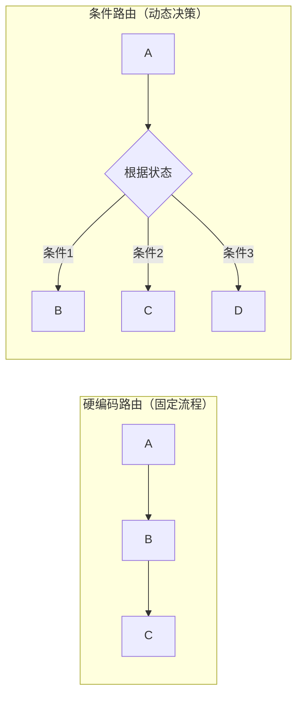
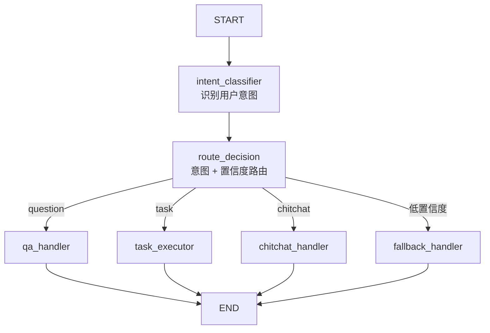
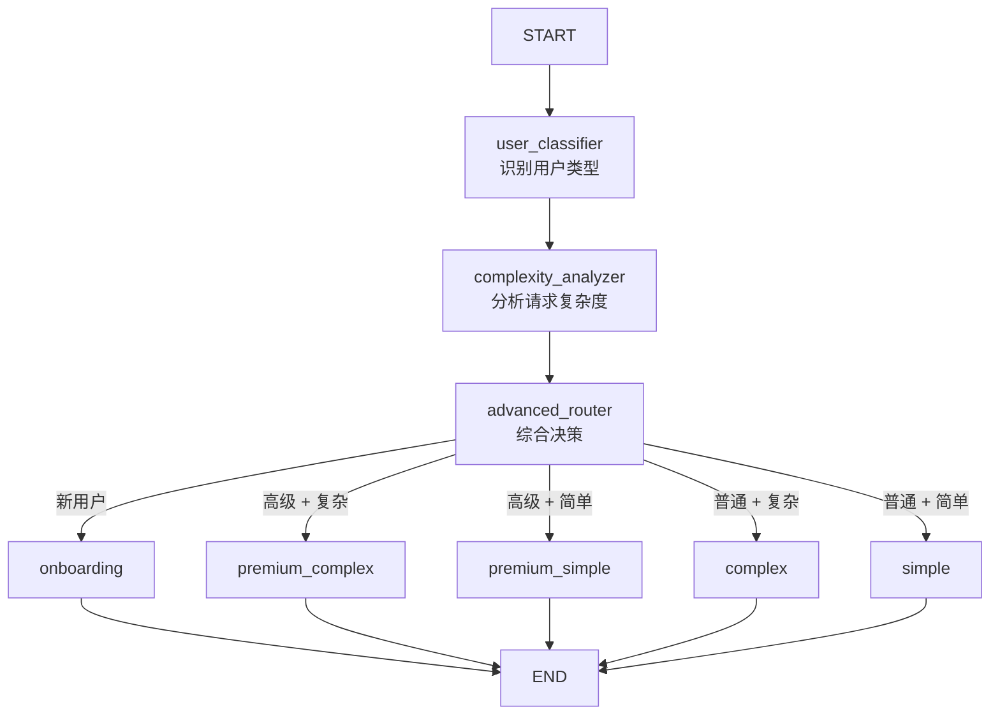
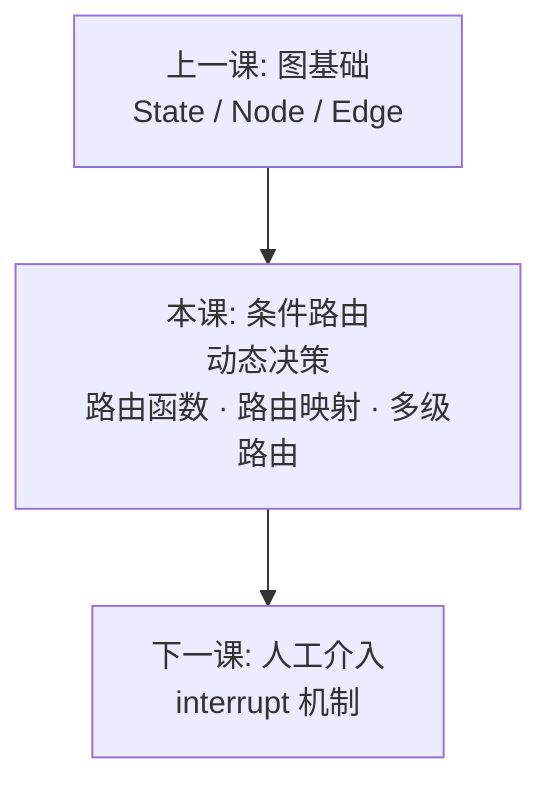

# 02 - LangGraph 条件路由

## 学习目标

- 掌握条件边的实现方式: 路由函数 + 映射
- 理解动态决策: 根据状态决定下一步
- 实现分支逻辑: 不同条件走不同路径
- 对比条件路由与硬编码路由的区别

## 运行方式

```bash
python 04_langgraph/02_conditional_edges.py
```

---

## 核心概念

### 1. 什么是条件路由？

条件路由是 LangGraph 的核心能力之一。它允许你**根据状态动态决定下一步执行哪个节点**：



**关键认知：** 条件路由让 Agent 具备了**智能决策**能力。不再是死板的流程，而是根据实际情况灵活选择路径。

### 2. 条件边的实现

条件边由两部分组成：

1. **路由函数**: `(state: State) -> str`，返回下一个节点的名称
2. **路由映射**: `{返回值: 节点名}`，将路由函数的返回值映射到具体节点

```python
def route_after_decision(state: RouterState) -> str:
    """路由函数: 返回下一个节点名称"""
    return state["route"]

graph.add_conditional_edges(
    "route_decision",      # 源节点
    route_after_decision,  # 路由函数
    {
        "qa": "qa",                    # 映射: 返回值 → 节点名
        "task_executor": "task_executor",
        "chitchat": "chitchat",
        "fallback": "fallback",
    }
)
```

### 3. 路由决策流程

典型的路由决策分两步：

1. **分析阶段**: 识别意图、评估状态
2. **决策阶段**: 根据分析结果选择路径

```python
def intent_classifier(state: RouterState) -> dict:
    """意图分类器"""
    user_text = state["messages"][-1].content
    
    if "什么" in user_text:
        intent = "question"
    elif "帮我" in user_text:
        intent = "task"
    else:
        intent = "chitchat"
    
    return {"intent": intent}

def route_decision(state: RouterState) -> dict:
    """路由决策"""
    intent = state["intent"]
    
    if intent == "question":
        route = "qa"
    elif intent == "task":
        route = "task_executor"
    else:
        route = "chitchat"
    
    return {"route": route}
```

---

## 代码实现详解

### 基础意图路由

本课实现了一个完整的意图路由系统：



**节点说明：**

| 节点 | 作用 |
|------|------|
| `intent_classifier` | 识别用户意图 (question/task/chitchat) |
| `route_decision` | 根据意图和置信度决定路由 |
| `qa_handler` | 处理问题类意图 |
| `task_executor` | 处理任务类意图 |
| `chitchat_handler` | 处理闲聊类意图 |
| `fallback_handler` | 降级处理 (无法识别时) |

### 路由策略

```python
def route_decision(state: RouterState) -> dict:
    intent = state["intent"]
    confidence = state["confidence"]
    
    # 低置信度 → 降级
    if confidence < 0.6:
        route = "fallback"
    elif intent == "question":
        route = "qa"
    elif intent == "task":
        route = "task_executor"
    elif intent == "chitchat":
        route = "chitchat"
    else:
        route = "fallback"
    
    return {"route": route}
```

**关键点：**
- 不仅看意图，还看置信度
- 置信度过低时走 fallback，而不是强行分类
- 这是一种**安全的**路由策略

### 高级多级路由

除了基础路由，本课还展示了多级路由：

```python
class AdvancedState(TypedDict):
    messages: Annotated[list[BaseMessage], add_messages]
    user_type: str           # "new" | "returning" | "premium"
    request_complexity: str  # "simple" | "complex"
    route: str
```

**路由逻辑：**

```python
def advanced_router(state: AdvancedState) -> dict:
    user_type = state["user_type"]
    complexity = state["request_complexity"]
    
    if user_type == "new":
        route = "onboarding"
    elif user_type == "premium" and complexity == "complex":
        route = "premium_complex"
    elif user_type == "premium" and complexity == "simple":
        route = "premium_simple"
    elif complexity == "complex":
        route = "complex"
    else:
        route = "simple"
    
    return {"route": route}
```

**流程：**



---

## 常见路由模式

### 1. 意图路由 (本课示例)

- 根据用户意图分类到不同处理器
- 适用: 客服系统、智能助手

### 2. 权限路由

- 根据用户角色/权限决定处理路径
- 适用: SaaS 产品、多租户系统

```python
def permission_router(state: State) -> str:
    if state["user_role"] == "admin":
        return "admin_handler"
    elif state["user_role"] == "premium":
        return "premium_handler"
    else:
        return "basic_handler"
```

### 3. 复杂度路由

- 根据任务复杂度分配资源
- 适用: 任务调度、资源分配

```python
def complexity_router(state: State) -> str:
    if state["task_complexity"] > 0.8:
        return "advanced_model"  # 用更强的模型
    else:
        return "basic_model"     # 用轻量模型
```

### 4. 状态机路由

- 根据业务状态流转决定下一步
- 适用: 订单处理、审批流程

```python
def order_state_router(state: State) -> str:
    order_status = state["order_status"]
    
    if order_status == "pending":
        return "payment_handler"
    elif order_status == "paid":
        return "fulfillment_handler"
    elif order_status == "shipped":
        return "delivery_handler"
    else:
        return "completion_handler"
```

### 5. 混合路由 (高级示例)

- 多维度综合决策
- 适用: 复杂业务场景

---

## 实践经验

**Q: 路由函数可以返回任意字符串吗？**

A: 不可以。路由函数返回的字符串必须在路由映射中定义：

```python
graph.add_conditional_edges(
    "source_node",
    route_function,
    {
        "option_a": "node_a",  # 路由函数返回 "option_a" → 执行 node_a
        "option_b": "node_b",
        END: END,              # 路由函数返回 END → 结束
    }
)
```

**Q: 如何避免路由死循环？**

A: 
1. 在状态中添加计数器，限制循环次数
2. 路由函数中检查是否已经访问过某个节点
3. 设置最大执行步数

```python
def safe_router(state: State) -> str:
    if state["step_count"] >= 10:
        return END  # 强制结束
    # 正常路由逻辑
    ...
```

**Q: 路由决策应该基于什么？**

A: 路由决策应该基于 State 中的信息，常见依据：
- 用户意图 (intent)
- 置信度 (confidence)
- 用户角色 (role)
- 任务复杂度 (complexity)
- 业务状态 (status)

**Q: 可以串联多个路由节点吗？**

A: 可以，这就是多级路由。例如：
- 第一级: 识别用户类型
- 第二级: 识别请求复杂度
- 第三级: 综合决策

---

## 知识脉络



条件路由是 LangGraph 的核心能力。掌握了它，你就能构建智能、灵活的 Agent 工作流。

---

## 下一步

→ [03 - 人工介入](03_human_in_loop.md)
