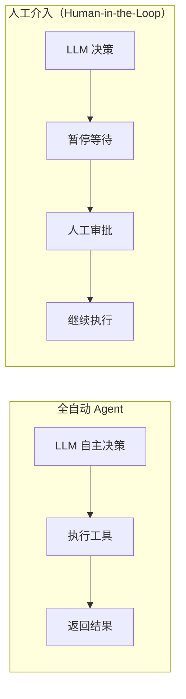
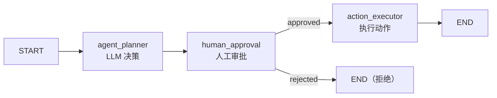
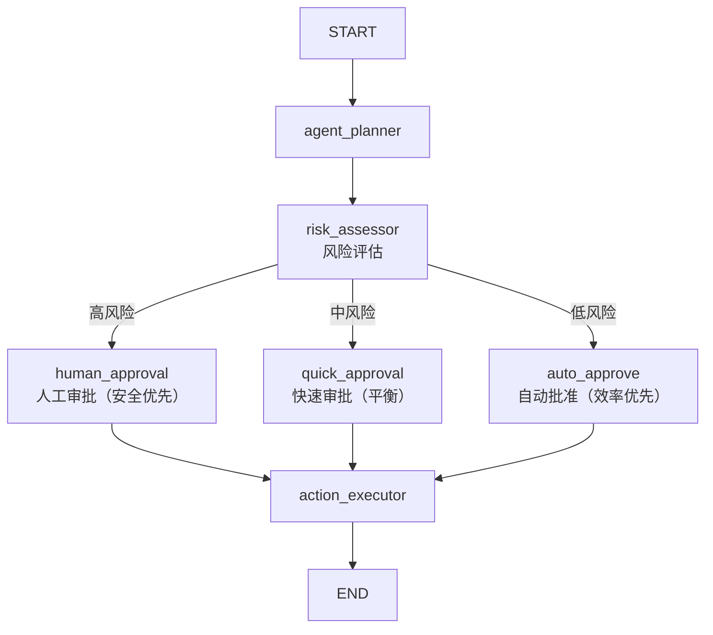
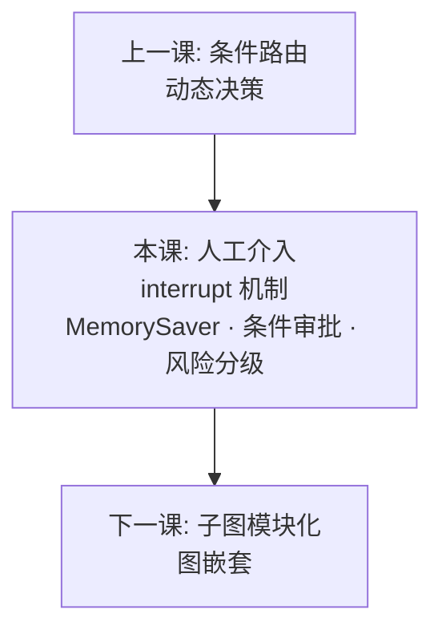

# 03 - LangGraph 人工介入

## 学习目标

- 掌握 interrupt 机制: 在关键节点暂停等待人工输入
- 理解断点恢复: 从暂停点继续执行
- 实现审批节点: 人工审核 Agent 的决策
- 理解 human-in-the-loop 的应用场景

## 运行方式

```bash
python 04_langgraph/03_human_in_loop.py
```

---

## 核心概念

### 1. 什么是 Human-in-the-Loop？

Human-in-the-Loop (HITL) 是一种**人工介入机制**，让 Agent 在关键决策点暂停，等待人工审批或指导：



**关键认知：** HITL 不是降低自动化程度，而是**增加安全性**。它让 Agent 在高风险操作前获得人工确认，避免错误和损失。

### 2. interrupt 机制

LangGraph 通过 `interrupt` 实现人工介入：

```python
from langgraph.checkpoint.memory import MemorySaver

def human_approval(state: ApprovalState) -> dict:
    """人工审批节点"""
    print("等待人工审批...")
    
    # 这里会暂停，等待人工输入
    # 实际项目中通过 API 或 UI 获取审批结果
    
    return {
        "approval_status": "approved",  # 或 "rejected"
        "human_feedback": "可以执行",
    }

# 编译图时启用 checkpointer
checkpointer = MemorySaver()
app = graph.compile(checkpointer=checkpointer)
```

**要点：**
- `MemorySaver` 保存图的状态，支持中断和恢复
- 节点可以暂停等待人工输入
- 人工输入后，图从暂停点继续执行

### 3. 审批流程

典型的审批流程：



**状态流转：**

```python
# 1. Agent 规划
agent_planner:
  输入: 用户请求
  输出: {action: "delete_data", approval_status: "pending"}

# 2. 人工审批
human_approval:
  输入: approval_status = "pending"
  处理: 等待人工输入
  输出: {approval_status: "approved", human_feedback: "可以执行"}

# 3. 执行动作
action_executor:
  输入: approval_status = "approved"
  输出: {messages: [AIMessage("✓ 操作完成")]}
```

---

## 代码实现详解

### 基础审批图

```python
def build_approval_graph() -> StateGraph:
    checkpointer = MemorySaver()
    
    graph = StateGraph(ApprovalState)
    
    graph.add_node("agent_planner", agent_planner)
    graph.add_node("human_approval", human_approval)
    graph.add_node("action_executor", action_executor)
    
    graph.add_edge(START, "agent_planner")
    graph.add_edge("agent_planner", "human_approval")
    graph.add_edge("human_approval", "action_executor")
    graph.add_edge("action_executor", END)
    
    return graph.compile(checkpointer=checkpointer)
```

**关键：** `checkpointer=MemorySaver()` 启用了状态持久化，支持中断和恢复。

### 条件审批

除了基础审批，本课还展示了**条件审批**：根据风险等级动态决定是否需要人工审批。

```python
def conditional_approval_router(state: ApprovalState) -> str:
    """条件审批路由: 根据风险等级决定"""
    risk_status = state["approval_status"]
    
    if risk_status == "risk_high":
        return "human_approval"    # 高风险: 人工审批
    elif risk_status == "risk_medium":
        return "quick_approval"    # 中风险: 快速审批
    else:
        return "auto_approve"      # 低风险: 自动批准
```

**流程：**



**优势：**
- 高风险操作需要人工审批 (安全)
- 中风险操作快速审批 (效率)
- 低风险操作自动批准 (自动化)

---

## 常见 HITL 模式

### 1. 审批模式 (本课示例)

- Agent 决策 → 人工审批 → 执行/拒绝
- 适用: 高风险操作、合规要求

```python
# 示例: 删除数据前需要审批
if action == "delete_data":
    return "human_approval"  # 必须人工审批
```

### 2. 确认模式

- Agent 准备执行 → 人工确认 → 继续
- 适用: 重要操作、不可逆操作

```python
# 示例: 发送邮件前确认
if action == "send_email":
    print("即将发送邮件，请确认...")
    # 等待人工确认
```

### 3. 修正模式

- Agent 生成内容 → 人工修正 → 使用修正后版本
- 适用: 内容生成、代码生成

```python
# 示例: 生成代码后人工修正
if node == "code_generator":
    code = generate_code()
    # 人工修正代码
    code = human_review(code)
```

### 4. 选择模式

- Agent 提供多个选项 → 人工选择 → 执行选中项
- 适用: 创意工作、方案设计

```python
# 示例: 提供多个方案供选择
options = generate_options()
selected = human_select(options)
execute(selected)
```

### 5. 监督模式

- Agent 持续执行 → 人工随时可中断 → 调整方向
- 适用: 长时间任务、复杂任务

```python
# 示例: 长时间运行的任务
for step in long_running_task():
    if human_interrupt():
        adjust_direction()
```

---

## 实践经验

**Q: 为什么需要人工介入？**

A: 
1. **安全性**: 防止 Agent 执行危险操作 (如删除数据、发送邮件)
2. **合规性**: 某些操作需要人工确认 (如金融交易、医疗决策)
3. **质量控制**: 人工审核 Agent 的输出质量
4. **错误拦截**: 在 Agent 犯错前及时纠正

**Q: MemorySaver 的作用是什么？**

A: `MemorySaver` 是 LangGraph 的 checkpointer 实现，它：
- 保存图的执行状态
- 支持中断和恢复
- 追踪对话/任务状态 (通过 thread_id)

```python
config = {"configurable": {"thread_id": "test_123"}}
final_state = app.invoke(initial_state, config)
```

**Q: 如何在实际项目中获取人工输入？**

A: 本课使用模拟输入，实际项目中可以通过：
1. **API**: 提供 REST API，前端调用获取审批结果
2. **UI**: Web 界面展示审批请求，用户点击批准/拒绝
3. **消息队列**: 发送审批请求到队列，人工处理后返回结果

```python
# 实际项目示例
def human_approval(state: ApprovalState) -> dict:
    # 发送审批请求
    approval_request = {
        "action": state["action"],
        "params": state["action_params"],
    }
    send_to_ui(approval_request)
    
    # 等待人工输入 (通过 API 或消息队列)
    result = wait_for_human_input()
    
    return {
        "approval_status": result["decision"],
        "human_feedback": result["feedback"],
    }
```

**Q: 人工介入会降低效率吗？**

A: 会，但可以通过**条件审批**平衡安全和效率：
- 高风险: 人工审批 (安全优先)
- 中风险: 快速审批 (平衡)
- 低风险: 自动批准 (效率优先)

---

## 知识脉络



Human-in-the-Loop 是生产级 Agent 的必备能力。掌握了它，你就能构建安全、可控、合规的 Agent 系统。

---

## 下一步

→ [04 - 子图模块化](04_subgraph.md)
