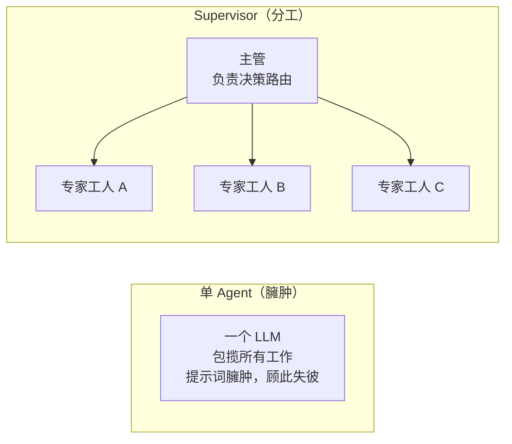
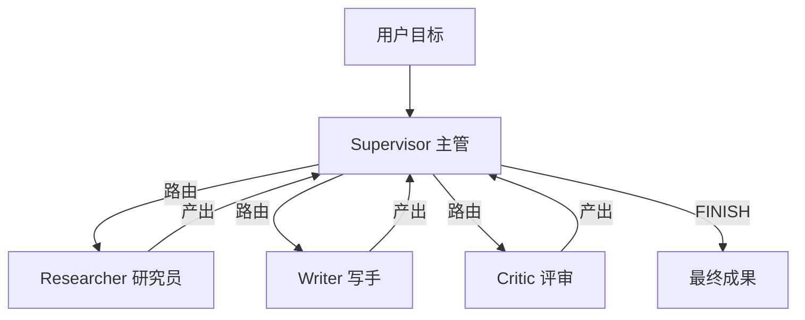
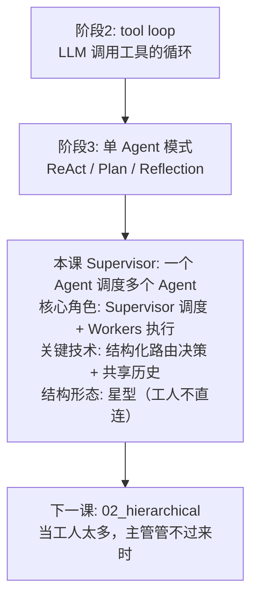

# 01 - Supervisor 模式 (主管-工人架构)

## 学习目标

- 理解多 Agent 系统中最经典的架构：Supervisor（主管）+ Workers（工人）
- 掌握"主管路由 → 工人执行 → 结果汇总"的核心循环
- 学会用结构化输出让 Supervisor 做出可靠的调度决策
- 理解职责分工如何让每个 Agent 更专注、更可靠

## 运行方式

```bash
python 06_multi_agent/01_supervisor.py
```

---

## 核心概念

### 1. 为什么需要多 Agent？

阶段 1-5 我们一直在打磨"单个 Agent"：给它工具、给它记忆、给它反思能力。但单个 Agent 有个天花板——**当任务需要多种不同的专长时，一个臃肿的 System Prompt 很难同时把每件事都做好**。



这就像一个人硬扛整个项目 vs 一个团队分工协作。多 Agent 的本质是**用"分工"换取"专注"**。

### 2. Supervisor 架构



这是一个**星型结构**：主管居中，工人在四周。关键特征是**工人之间不直接对话**，所有协调都经过主管。

主管本身不生产内容，只做两件事：

| 职责 | 说明 |
|------|------|
| **路由 (Routing)** | 看当前进展，决定下一步交给哪个工人 |
| **终止 (Termination)** | 判断任务是否已完成，该不该结束 |

### 3. Worker：专注的领域专家

每个 Worker 由一个专属的 System Prompt 定义人格与职责。它只需要专注做好自己那一件事：

| Worker | 职责 | System Prompt 关键特征 |
|--------|------|------------------------|
| **researcher** | 收集资料、罗列事实要点 | "严谨的研究员，只提供素材" |
| **writer** | 把素材整理成通顺成稿 | "专业写手，不编造事实" |
| **critic** | 挑出问题、给改进建议 | "严格的评审" |

因为职责单一，每个 Worker 的提示词都很短、很聚焦——这正是它比"全能单 Agent"更可靠的原因。

---

## 代码实现详解

### 主管的决策：用结构化输出保证可靠

主管的输出被约束为 JSON，这样程序才能可靠地解析出"下一步给谁"：

```python
SUPERVISOR_SYSTEM = """你是一个多 Agent 团队的主管(Supervisor)。
...
## 输出格式 (严格的 JSON)
{
  "reasoning": "你为什么这样决策 (一句话)",
  "next": "researcher | writer | critic | FINISH",
  "instruction": "交给该工人的具体指令 (若 next=FINISH 则留空)"
}
"""

def supervisor_decide(goal: str, history: list[dict]) -> dict:
    progress = "\n\n".join(...)  # 把历史进展整理给主管看
    response = client().chat.completions.create(
        model=get_model(),
        messages=[...],
        response_format={"type": "json_object"},
        temperature=0,  # 调度决策需要确定性
    )
    return json.loads(response.choices[0].message.content)
```

**两个关键设计：**

- `response_format={"type": "json_object"}` —— 强制 JSON 输出，把"路由决策"变成可解析的数据（回忆阶段 1 的结构化输出）。
- `temperature=0` —— 调度是逻辑判断，不需要创造性，用确定性输出让行为可复现。

### 工人的执行：能看到共享上下文

```python
def run_worker(worker_key: str, task: str, shared_context: str) -> str:
    worker = WORKERS[worker_key]
    user_content = f"【当前子任务】\n{task}\n\n【已有进展/共享上下文】\n{shared_context or '(暂无)'}"
    response = client().chat.completions.create(
        model=get_model(),
        messages=[
            {"role": "system", "content": worker["system"]},  # 决定它的专长
            {"role": "user", "content": user_content},
        ],
        temperature=0.7,
    )
    return response.choices[0].message.content
```

注意 Worker 拿到的不只是自己的子任务，还有 `shared_context`——**前面工人产出的成果**。这让 writer 能基于 researcher 的素材写作，让 critic 能评审 writer 的稿件。

### 主循环：路由 → 执行 → 记录 → 再路由

```python
def supervisor_agent(goal: str, max_steps: int = 8) -> str:
    history = []  # 共享历史: 每个工人的产出都记录在这里

    for step in range(max_steps):
        decision = supervisor_decide(goal, history)  # 主管决策

        if decision["next"] == "FINISH":
            break  # 主管宣布完成

        worker_key = decision["next"]
        shared_context = "\n\n".join(...)  # 把历史作为共享上下文
        output = run_worker(worker_key, decision["instruction"], shared_context)
        history.append({"worker": worker_key, "output": output})  # 写回历史

    # 取最后一次 writer 的产出作为最终成果
    return next((h["output"] for h in reversed(history) if h["worker"] == "writer"), ...)
```

**循环逻辑：**

1. 主管看历史 → 决定 `next`
2. 若 `next == FINISH` → 退出
3. 否则运行对应 Worker，把产出写回 `history`
4. 回到第 1 步（此时主管能看到新产出）

`max_steps` 是安全阀，防止主管陷入无限调度。

---

## 完整执行流程示例

```
目标: 写一段短文, 介绍"为什么多 Agent 协作能超越单个 Agent"

第1步 — 主管决策
[主管思考]: 还没有素材, 先让研究员收集要点
[主管决策]: next = researcher
  → [研究员产出]: • 分工降低单点复杂度 • 多视角减少盲区 • ...

第2步 — 主管决策
[主管思考]: 素材已备齐, 交给写手成稿
[主管决策]: next = writer
  → [写手产出]: "当一个任务需要多种专长时..."

第3步 — 主管决策
[主管思考]: 初稿完成, 让评审把关
[主管决策]: next = critic
  → [评审产出]: • 论点清晰, 但缺少具体例子 • 建议补一个类比

第4步 — 主管决策
[主管思考]: 评审指出要补例子, 让写手改稿
[主管决策]: next = writer
  → [写手产出]: "...就像医院里, 内科、外科、影像科各司其职..."

第5步 — 主管决策
[主管决策]: next = FINISH  ← 稿件已达标
```

---

## 设计模式深度分析

### 1. 关注点分离：主管为什么不干活？

你可能会问：既然主管这么"聪明"（能判断该给谁），为什么不让它直接写？

因为**调度和执行是两种不同的认知任务**。让主管专注"编排"，工人专注"执行"，每个 LLM 调用的注意力都更集中。这和阶段 3 Reflection 里"生成者 vs 批评者"角色分离是同一个原则——**分步处理降低了单步难度**。

### 2. 共享历史 vs 直接对话

本实现中工人不直接对话，而是通过主管维护的 `history` 间接协作。好处是：

- **可控**：所有信息流经主管，便于审计和干预
- **简单**：不需要设计工人间的通信协议

代价是主管成了信息枢纽，任务一复杂，主管的提示词就会膨胀——这正是下一课 **层级式架构** 要解决的问题。

### 3. 与阶段 3/4 的关系

| 对比 | Supervisor 多 Agent | 单 Agent (阶段 3) |
|------|--------------------|--------------------|
| 决策者 | 主管 LLM 显式路由 | 单个 LLM 内部隐式决定 |
| 专长 | 每个工人独立提示词 | 一个提示词包揽 |
| 可观测性 | 每步都能看到"给了谁、产出什么" | 决策过程在一次生成内 |

其实 Supervisor 的主循环，和阶段 2 的 tool loop 神似——只不过"工具"换成了"能自主思考的 Agent"。**这是一个重要认知：Agent 可以把另一个 Agent 当作工具来调用。**

---

## 实践经验

**Q: 主管应该用更强的模型吗？**
A: 通常是的。主管负责全局调度，需要更好的判断力；工人执行明确的子任务，可以用便宜的模型。实践中常见"强主管 + 廉价工人"的搭配来控制成本。

**Q: 主管陷入循环怎么办（反复调度同一个工人）？**
A: 三道防线：① `max_steps` 硬上限；② 在 System Prompt 里明确流程和"最多来回一轮"；③ 把已完成的步骤清晰地喂给主管，让它知道"这步做过了"。

**Q: 工人可以有自己的工具吗？**
A: 完全可以。工人本身可以是一个完整的 ReAct Agent（阶段 3）或 LangGraph 子图（阶段 4），内部调用工具、甚至 MCP（阶段 5）。Supervisor 只关心它的输入输出。

**Q: 什么时候不该用 Supervisor？**
A: 任务简单、单一专长就能搞定时，多 Agent 只会增加延迟和成本。多 Agent 的价值在于**任务真的需要多种专长协同**。

---

## 知识脉络



---

## 下一步

→ [02 - 层级式架构](02_hierarchical.md)
