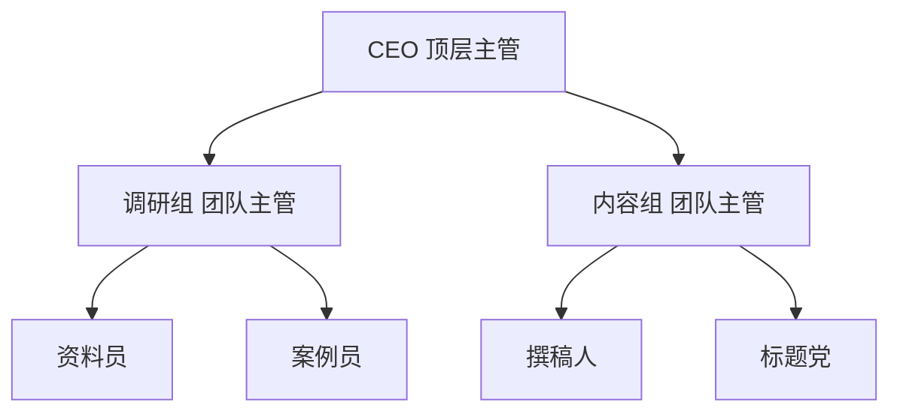
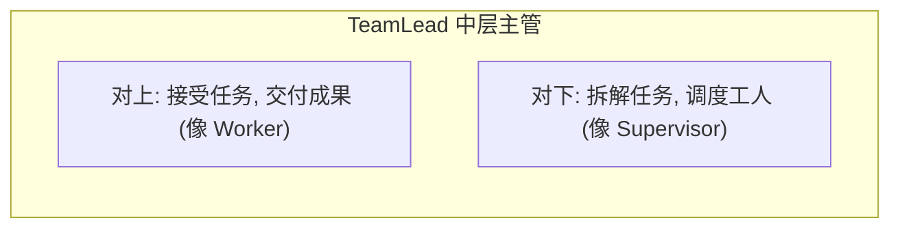
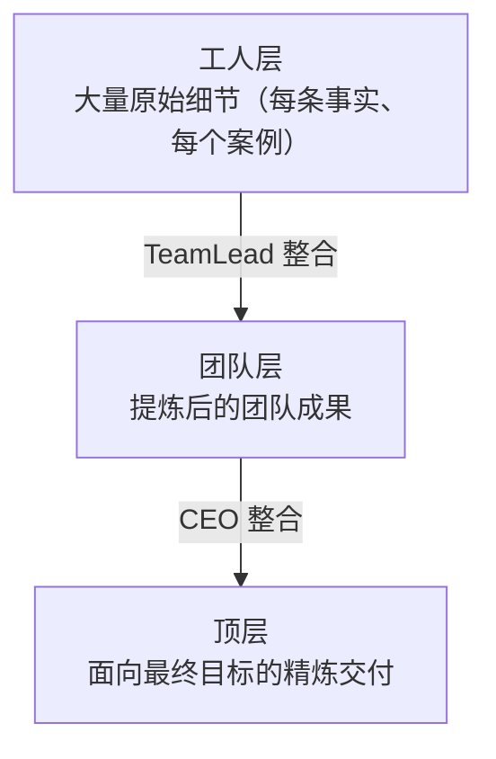
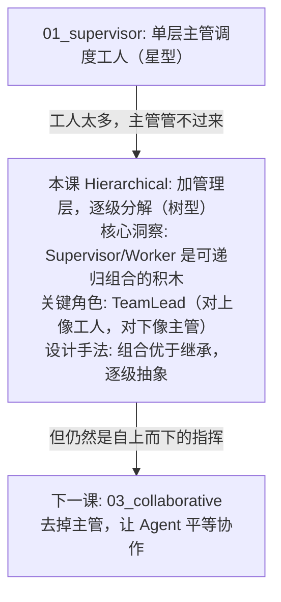

# 02 - 层级式架构 (Hierarchical Multi-Agent)

## 学习目标

- 理解 Supervisor 模式的递归扩展：主管之下还有主管
- 掌握"逐级分解"的思想：大任务 → 子任务 → 具体执行
- 学会用组合（而非继承）搭建多层团队结构
- 理解层级架构如何应对单层 Supervisor 扛不住的复杂任务

## 运行方式

```bash
python 06_multi_agent/02_hierarchical.py
```

---

## 核心概念

### 1. 单层 Supervisor 的天花板

上一课的 Supervisor 让一个主管直接管理所有工人。但当工人从 3 个变成 30 个、涉及多个完全不同的领域时，问题就来了：

```
单层 Supervisor: 1 个主管直接管 N 个工人
  → 工人一多, 主管的调度提示词就会爆炸 (要理解每个工人的能力)
  → 主管成了瓶颈和单点故障
```

解决办法和人类组织完全一样：**加一层管理**。

### 2. 层级式：像公司组织架构



```
CEO (顶层)
 ├── 研发经理 (中层主管) → 后端工程师 / 前端工程师 (工人)
 └── 市场经理 (中层主管) → 文案 / 设计 (工人)
```

**每一层只需理解"下一层能做什么"，无需了解最底层细节**——这就是软件工程里的抽象与分治。CEO 不需要知道"资料员"具体怎么查资料，只需要知道"调研组能给我素材"。

### 3. 关键洞察：Supervisor 和 Worker 是可递归组合的积木

层级式最优雅的地方在于：**"中层主管"这个角色，对上像工人，对下像主管**。



正因为这种"双面性"，我们可以像搭积木一样，把 Supervisor 和 Worker 递归地组合成任意深度的树。

---

## 代码实现详解

### 三种积木：Worker / TeamLead / TopManager

本课用**组合**的方式实现层级——每一层是一个类，持有对下一层的引用。

#### 1. `Worker` — 底层工人

```python
class Worker:
    """底层工人: 拿到具体任务, 直接产出结果。"""
    def __init__(self, name: str, system: str):
        self.name = name
        self.system = system

    def run(self, task: str, indent: int = 0) -> str:
        output = llm(self.system, f"请完成以下任务:\n{task}")
        return output
```

最简单的一层，直接调 LLM 产出结果。`indent` 只是为了打印出漂亮的树形缩进。

#### 2. `TeamLead` — 中层主管（关键角色）

```python
class TeamLead:
    def __init__(self, name: str, mission: str, workers: list[Worker]):
        self.name = name
        self.mission = mission   # 这个团队擅长什么
        self.workers = workers

    def _plan(self, task: str) -> list[dict]:
        """把交办的子任务, 拆解成分派给各工人的指令"""
        # 输出 JSON: {"assignments": [{"worker": ..., "instruction": ...}]}

    def _synthesize(self, task: str, results: list[str]) -> str:
        """把工人们的产出整合成团队成果"""

    def run(self, task: str, indent: int = 0) -> str:
        assignments = self._plan(task)          # 拆
        results = [w.run(a["instruction"]) ...] # 分派
        return self._synthesize(task, results)  # 合
```

`TeamLead.run()` 的签名和 `Worker.run()` **完全一样**（都是 `task → 成果`）——这就是"对上像工人"。而它内部做的"拆解→分派→整合"，又和上一课的 Supervisor **一模一样**——这就是"对下像主管"。

#### 3. `TopManager` — 顶层主管（CEO）

```python
class TopManager:
    def __init__(self, teams: list[TeamLead]):
        self.teams = teams

    def run(self, goal: str) -> str:
        tasks = self._delegate(goal)               # 把总目标分给各团队
        deliverables = [team.run(t["subtask"]) ...] # 每个团队递归展开
        return self._final_report(goal, deliverables)  # 整合最终交付
```

CEO 只面对几个"团队"，把大目标拆成几个子任务分下去，再把团队成果整合成最终交付。它根本不知道底层有哪些工人。

### 组装一个两层团队

```python
def build_company() -> TopManager:
    research_team = TeamLead(
        name="调研组", mission="收集事实、数据与背景资料",
        workers=[Worker("资料员", ...), Worker("案例员", ...)],
    )
    content_team = TeamLead(
        name="内容组", mission="把素材写成通顺、有吸引力的成稿",
        workers=[Worker("撰稿人", ...), Worker("标题党", ...)],
    )
    return TopManager(teams=[research_team, content_team])
```

搭建过程就像画组织架构图——这正是"组合优于继承"的体现：用简单积木拼出复杂结构。

---

## 完整执行流程示例

```
[CEO] 总目标: 产出一篇面向初学者的科普短文, 主题'什么是多 Agent 系统'
[CEO] 逐级分解中...

├─ [调研组 团队] 接到任务: 收集'多 Agent 系统'的关键概念和实例
   └─ [资料员] 执行: 罗列多 Agent 系统的核心概念和特征
      [资料员] 产出: • 定义 • 通信机制 • 协作模式...
   └─ [案例员] 执行: 找出多 Agent 系统的生动实例
      [案例员] 产出: • 蜂群机器人 • 自动驾驶车队...
   [调研组 团队] 交付整合成果 (2 份产出)

├─ [内容组 团队] 接到任务: 把调研素材写成科普短文
   └─ [撰稿人] 执行: 组织成结构清晰的文章
      [撰稿人] 产出: "想象一群蚂蚁如何搬运食物..."
   └─ [标题党] 执行: 拟 3 个吸引人的标题
      [标题党] 产出: 1)《AI 也讲团队协作》...
   [内容组 团队] 交付整合成果 (2 份产出)

[最终交付物]: (CEO 整合两个团队的成果)
```

注意输出的**树形缩进**——它直观地展示了任务如何逐级向下分解、成果如何逐级向上汇聚。

---

## 设计模式深度分析

### 1. 为什么用组合，而不是"一个通用 Agent 类"？

我们本可以设计一个既能当主管又能当工人的"万能 Agent 类"。但把三种角色拆成 `Worker` / `TeamLead` / `TopManager`，每个类只承担一层的职责，代码反而更清晰。这与阶段 4 LangGraph 的**子图**思想一脉相承——**用模块边界管理复杂度**。

### 2. 层级 = 递归的 Supervisor

如果你把 `TeamLead` 看成"一个内部藏着 Supervisor 的 Worker"，整个架构就变成了**递归的 Supervisor**。理论上你可以无限套娃：`TopManager → TeamLead → 子TeamLead → Worker`。层数越多，能处理的任务越复杂，但延迟和成本也线性增长。

### 3. 信息的"逐级抽象"

层级架构自带一个好处：**信息在向上汇聚时被逐级压缩**。



CEO 不会被底层的海量细节淹没——每一层都帮它过滤、提炼了信息。这正是人类组织能处理超大规模任务的原因。

---

## 与 Supervisor 模式的对比

| 对比维度 | Supervisor (单层) | Hierarchical (层级) |
|----------|-------------------|---------------------|
| 结构形态 | 星型（1 主管 + N 工人） | 树型（多层主管） |
| 主管负担 | 要理解所有工人 | 每层只理解下一层 |
| 适用规模 | 少量工人、单一领域 | 大量工人、多领域 |
| 信息流 | 全部经过唯一主管 | 逐级抽象、层层过滤 |
| 复杂度 | 简单直接 | 结构清晰但层数多则慢 |

**选择原则：** 先用 Supervisor，当主管的调度提示词开始"什么都要管"时，就该引入层级了。

---

## 实践经验

**Q: 层级越深越好吗？**
A: 不是。每加一层就多一轮 LLM 调用（规划 + 整合），延迟和成本都上升。实践中 2-3 层足以覆盖绝大多数场景，超过 3 层往往说明任务拆分方式有问题。

**Q: 找不到指定工人时会怎样？**
A: 本实现做了容错——`_plan` 若指派了不存在的工人名，`run` 会退化为交给团队的第一个工人。生产系统里应该更严格地校验或让主管重新规划。

**Q: 各层可以用不同的模型吗？**
A: 强烈建议。CEO 和 TeamLead 做规划整合，用强模型；底层 Worker 执行明确任务，用廉价模型。这样在"强调度 + 廉价执行"之间取得成本平衡。

**Q: 团队之间能并行吗？**
A: 可以。本课为了输出清晰用了串行，但各团队的任务相互独立时完全可以并发执行（`asyncio` 或线程池），大幅降低总延迟。

---

## 知识脉络



---

## 下一步

→ [03 - 协作式架构](03_collaborative.md)
