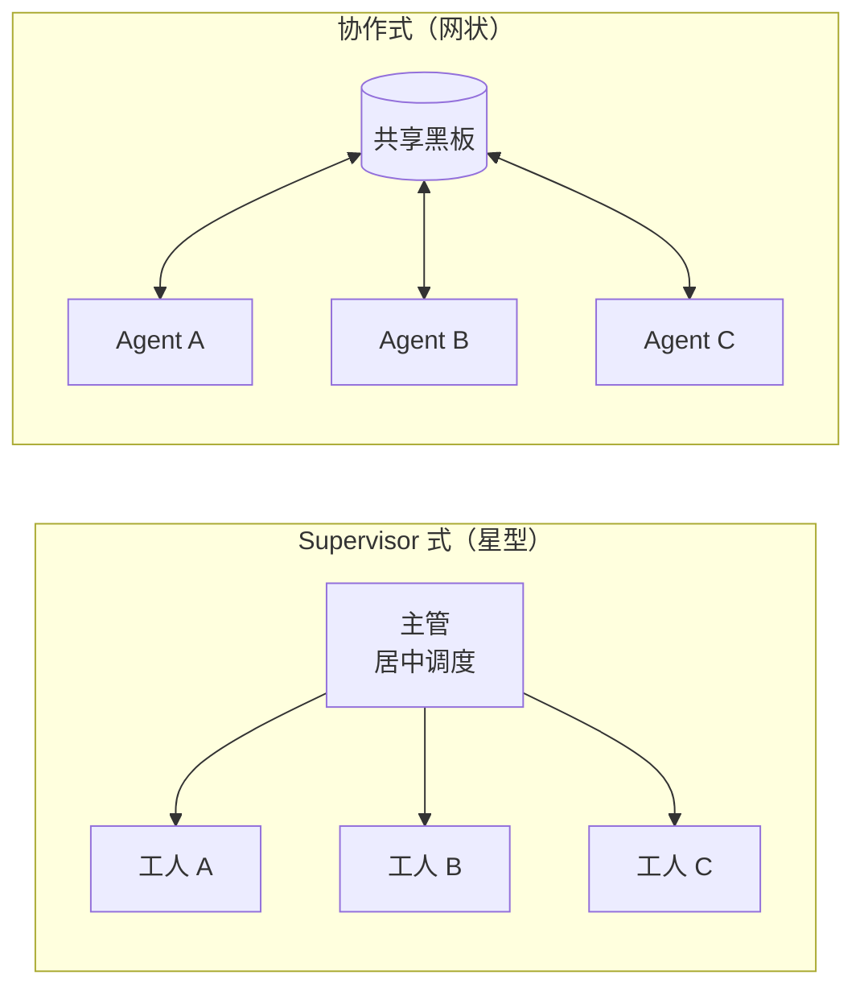
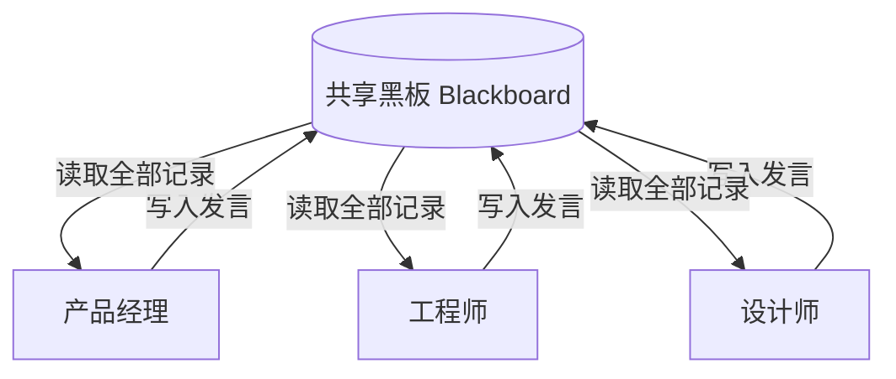
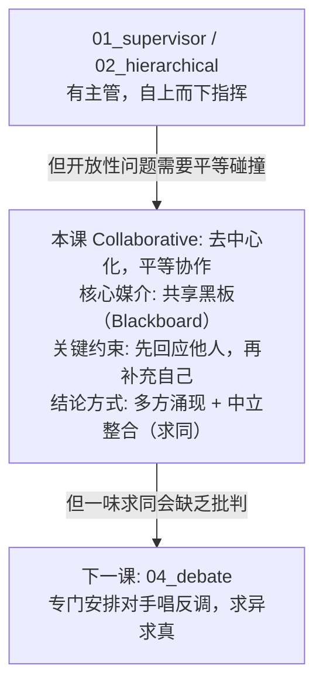

# 03 - 协作式架构 (Collaborative Multi-Agent)

## 学习目标

- 理解"去中心化"协作：没有主管，Agent 之间平等协作
- 掌握共享上下文（黑板 / blackboard）作为协作媒介的思想
- 学会用"轮流发言"（round-robin）的方式推进多方讨论
- 理解协作式与 Supervisor 式的本质区别：谁来决定下一步

## 运行方式

```bash
python 06_multi_agent/03_collaborative.py
```

---

## 核心概念

### 1. 从"指挥"到"协作"

前两课（Supervisor、Hierarchical）都有一个共同点：**有人指挥**。任务是被"自上而下"分配的。但很多问题不是这样的——比如头脑风暴、方案评审，没有谁天生比谁更"对"，好想法是在平等交流中碰撞出来的。



### 2. 共享黑板（Blackboard）

协作式没有主管传话，那 Agent 之间怎么"看见"彼此？答案是**共享黑板**——一块所有人都能读写的公共记忆。



```
所有 Agent 读同一块黑板, 也把自己的发言写回黑板。
每个 Agent 都能承接、呼应、补充别人的观点。
```

这是一个经典的 AI 架构模式（Blackboard System），思想很朴素：**用一块共享的公共记忆代替复杂的点对点通信**。

### 3. 结论是"涌现"出来的

Supervisor 式里，最终成果由主管指定的工人产出。协作式里没有这样的"钦定者"——结论是从多方交流中**涌现**（emerge）的，最后由一个中立的整合者归纳。

---

## 代码实现详解

### 核心数据结构：Blackboard

```python
class Blackboard:
    """共享黑板: 所有 Agent 读写的同一块公共记忆。"""
    def __init__(self, topic: str):
        self.topic = topic
        self.entries = []  # 每条 = {"speaker": 谁, "content": 说了什么}

    def write(self, speaker: str, content: str) -> None:
        self.entries.append({"speaker": speaker, "content": content})

    def transcript(self) -> str:
        """把黑板上的全部发言渲染成 Agent 可读的讨论记录"""
        return "\n\n".join(f"【{e['speaker']}】: {e['content']}" for e in self.entries)
```

黑板本身就是个"带说话人标记的列表"。`transcript()` 把它渲染成讨论记录，每个 Agent 发言前都会先读一遍。

### 让 Agent 承接他人：协作的关键

```python
def speak(agent: dict, board: Blackboard) -> str:
    system = (
        f"{agent['system']}\n\n"
        "你正在参加一场多人圆桌讨论。请先简要回应/呼应前面同事的观点, "
        "再补充你自己的看法。不要重复别人已经说过的内容, 控制在 3 句话以内。"
    )
    user = (
        f"讨论主题: {board.topic}\n\n"
        f"目前的讨论记录:\n{board.transcript()}\n\n"
        f"现在轮到你({agent['name']})发言。"
    )
    response = client().chat.completions.create(
        messages=[{"role": "system", ...}, {"role": "user", ...}],
        temperature=0.8,  # 协作/头脑风暴需要一些发散性
    )
    return response.choices[0].message.content
```

**两个关键设计：**

- **"先回应，再补充"** —— System Prompt 明确要求 Agent 承接前面的讨论，而不是自说自话。这是"协作"与"各说各话"的分水岭。如果没有这句约束，几个 Agent 只会平行地输出观点，谈不上协作。
- **`temperature=0.8`** —— 与 Supervisor 的 `temperature=0` 形成对比。调度要确定性，头脑风暴要发散性。

### 中立整合者：归纳而非裁决

```python
def summarize(board: Blackboard) -> str:
    system = (
        "你是一名中立的会议记录员。请阅读整场讨论, 归纳出:\n"
        "1) 达成的共识  2) 存在的分歧  3) 综合各方的最终建议。用要点呈现。"
    )
    ...
```

注意这里是**归纳共识**（求同），而不是下一课辩论里的**裁决胜负**（求异）——这是协作式的性格。

### 主循环：轮流发言（round-robin）

```python
def collaborative_session(topic: str, rounds: int = 2) -> str:
    board = Blackboard(topic)

    for r in range(rounds):           # 进行若干轮
        for agent in AGENTS:          # 每轮每个 Agent 依次发言
            content = speak(agent, board)
            board.write(agent["name"], content)

    return summarize(board)           # 最后归纳
```

**没有主管决定谁说话**——用最简单的轮流机制（round-robin）推进。第一轮大家各抒己见，第二轮就能看到别人的观点并互相回应，讨论逐渐深入。

---

## 完整执行流程示例

```
讨论主题: 为"学习类 App"设计一个帮用户坚持每日学习的功能

=== 第 1 轮讨论 ===
【产品经理】: 用户坚持不下来的核心是"没有即时反馈"。建议做每日学习打卡 + 连续天数。
【工程师】: 打卡技术上很简单, 但要注意时区和补卡逻辑, 否则用户凌晨学习会掉签。
【设计师】: 连续天数要有强烈的视觉激励, 比如火苗动画, 断签时的挽留提示要克制不打扰。

=== 第 2 轮讨论 ===
【产品经理】: 同意工程师说的补卡, 可以给每月 1 次补签卡作为付费点, 兼顾体验和商业。
【工程师】: 补签卡涉及支付, 建议一期先做本地打卡, 二期再接支付, 降低首版风险。
【设计师】: 呼应"分期", 首版把火苗动画做扎实即可, 挽留提示用轻量的 toast 而非弹窗。

=== 归纳总结 ===
共识: 做每日打卡 + 连续天数 + 火苗视觉激励; 分期上线
分歧: 补签卡是否首版就要 (商业 vs 风险)
最终建议: 一期本地打卡+视觉激励, 二期加补签卡与支付
```

可以看到第 2 轮里，每个人都在**回应第 1 轮的观点**（"同意工程师说的…"、"呼应分期…"）——这就是共享黑板带来的协作效果。

---

## 设计模式深度分析

### 1. 去中心化的代价与收益

| | 收益 | 代价 |
|---|------|------|
| **协作式** | 多视角碰撞、结论更全面、无单点瓶颈 | 无人把控进度、可能发散跑题、需要额外的整合步骤 |

去掉主管换来了平等和多样性，但也失去了"方向盘"。所以协作式往往需要：① 轮数上限防止无限讨论；② 一个整合者收敛结论。

### 2. 为什么"共享黑板"这么重要？

如果没有黑板，让 N 个 Agent 两两通信，连接数是 O(N²)，还要设计复杂的消息协议。黑板把它简化成 O(N)——每个 Agent 只和黑板打交道。**这是用"共享状态"换掉"复杂通信"的经典权衡**，和阶段 4 LangGraph 里用共享 State 串联节点的思路完全一致。

### 3. Round-robin 只是最简单的调度

本课用"固定顺序轮流"是为了教学清晰。真实系统里发言顺序可以更聪明：

- **谁最相关谁先说**：根据当前话题动态选发言人
- **主持人模式**：加一个轻量主持 Agent 决定下一个发言者（这其实又滑向了 Supervisor）
- **自由发言**：Agent 自己判断"我有没有话要补充"，没有就跳过

---

## 三种架构横向对比

| 对比维度 | Supervisor | Hierarchical | Collaborative |
|----------|-----------|--------------|---------------|
| 有无主管 | 有（1 个） | 有（多层） | **无** |
| 结构形态 | 星型 | 树型 | 网状 |
| 谁定下一步 | 主管路由 | 各层主管 | 固定轮流 |
| 信息媒介 | 主管维护的历史 | 逐级传递 | **共享黑板** |
| 结论来源 | 指定工人产出 | 逐级整合 | **多方涌现 + 整合** |
| 适合任务 | 清晰分工 | 大规模多领域 | **开放性、多视角** |

---

## 实践经验

**Q: 协作式容易跑题，怎么控制？**
A: 三个手段：① 在每个 Agent 的 System Prompt 里锚定讨论主题；② 限制轮数；③ 可以在中途插入一次"主持人"发言把话题拉回来。

**Q: Agent 会不会互相"商业互吹"，缺乏批判？**
A: 会。协作式的性格是"求同"，天然倾向于附和。如果你需要的是"挑刺"和"审视"，应该用下一课的**辩论式**——专门安排一方唱反调。

**Q: 共享黑板会不会越来越长，撑爆上下文？**
A: 会。轮数多、Agent 多时，`transcript()` 会膨胀。应对方式：定期让整合者做"阶段性摘要"压缩黑板（回忆阶段 3 的记忆机制），只保留摘要 + 最近几轮原文。

**Q: 协作式和 Supervisor 能混用吗？**
A: 能，而且很常见。比如一个 Supervisor 下面挂一个"协作小组"作为工人——主管把开放性子任务丢给小组头脑风暴，再收回结论。架构模式是可以自由嵌套组合的。

---

## 知识脉络



---

## 下一步

→ [04 - 辩论式架构](04_debate.md)
