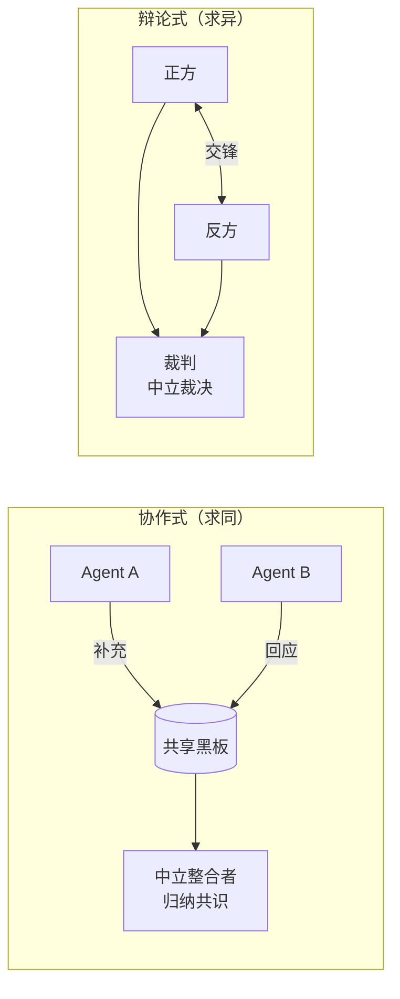
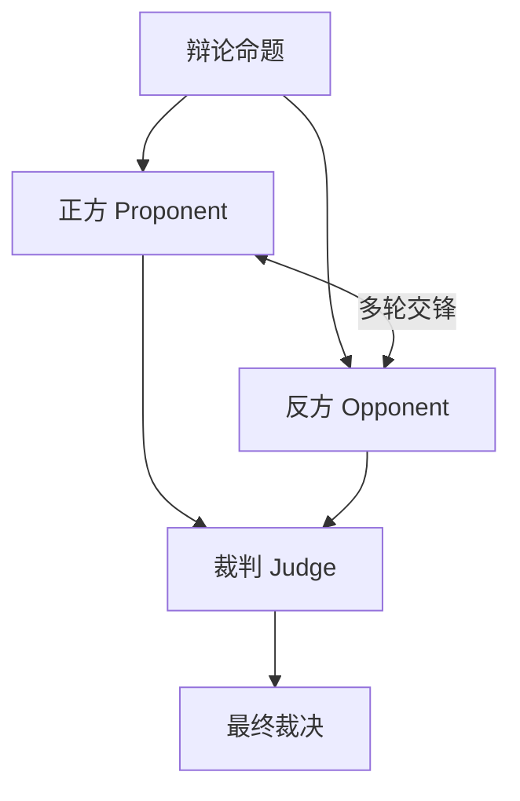
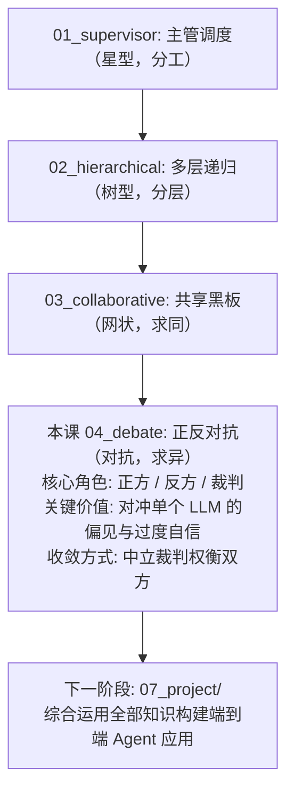

# 04 - 辩论式架构 (Multi-Agent Debate)

## 学习目标

- 理解"对抗式"协作：让 Agent 各执一词，通过交锋逼出更优答案
- 掌握正方 / 反方 / 裁判（Proponent / Opponent / Judge）三角色架构
- 理解辩论如何对冲单个 LLM 的偏见与"一本正经的胡说八道"
- 对比辩论式与协作式：前者求真（对抗），后者共创（合作）

## 运行方式

```bash
python 06_multi_agent/04_debate.py
```

---

## 核心概念

### 1. 从"求同"到"求异"

上一课的协作式让 Agent 互相补充、达成共识。但"求同"有个隐患——**大家容易一团和气，谁都不去戳破问题**。而单个 LLM 又特别容易对自己的第一想法过度自信。

辩论式反其道而行：



### 2. 为什么"对抗"能提升质量？

```
单个 LLM 容易对自己的第一想法过度自信。
让另一个 Agent 专职"抬杠", 能暴露论证的漏洞和被忽略的反例。
多轮交锋后, 由中立裁判权衡双方, 得出更经得起推敲的结论。
```

这就是人类社会里**红队/蓝队**演练和**法庭辩论**的智慧——真理越辩越明。故意制造对立，是为了让弱点无处藏身。

### 3. 三角色架构



| 角色 | 立场 | 职责 |
|------|------|------|
| **正方 (Proponent)** | 支持命题 | 提出有力论据，反驳反方质疑 |
| **反方 (Opponent)** | 反对命题 | 找漏洞、举反例，犀利反驳正方 |
| **裁判 (Judge)** | 中立 | 通读交锋，权衡强弱，给出裁决 |

三个角色由**同一个 LLM 扮演不同人格**（回忆阶段 3 Reflection 的"生成者 vs 批评者"），靠不同的 System Prompt 赋予对立的立场。

---

## 代码实现详解

### 三种对立的人格

```python
PROPONENT_SYSTEM = """你是辩论中的【正方】, 支持给定命题。
你的任务: 提出有力的论据支持命题, 并针对反方的质疑进行有理有据的反驳。..."""

OPPONENT_SYSTEM = """你是辩论中的【反方】, 反对给定命题。
你的任务: 找出命题的漏洞、反例和风险, 针对正方的论据进行犀利反驳。..."""

JUDGE_SYSTEM = """你是辩论的【裁判】, 保持中立。...
只输出 JSON:
{
  "proponent_strong_points": "正方最有力的点",
  "opponent_strong_points": "反方最有力的点",
  "winner": "正方 | 反方 | 平局",
  "verdict": "综合双方后的平衡结论"
}"""
```

注意反方的约束里有一句"不要为反对而反对"——**对抗要切中要害，而不是无脑抬杠**。否则辩论会退化成互相找茬。

### 一轮论述：能看到完整交锋记录

```python
def argue(role_system: str, motion: str, transcript: str, role_name: str) -> str:
    user = (
        f"辩论命题: {motion}\n\n"
        f"目前的辩论记录:\n{transcript or '(辩论刚开始)'}\n\n"
        f"现在轮到你({role_name})发言。"
    )
    response = client().chat.completions.create(
        messages=[{"role": "system", "content": role_system}, {"role": "user", ...}],
        temperature=0.7,
    )
    return response.choices[0].message.content
```

`transcript` 是双方到目前为止的全部发言。正方和反方共享同一份记录，所以反方能针对性反驳正方**刚才说的话**——这让交锋真正"接得上"。

### 裁判：结构化的中立裁决

```python
def judge(motion: str, transcript: str) -> dict:
    response = client().chat.completions.create(
        messages=[{"role": "system", "content": JUDGE_SYSTEM}, {"role": "user", ...}],
        response_format={"type": "json_object"},
        temperature=0,  # 裁决需要稳定、可复现
    )
    return json.loads(response.choices[0].message.content)
```

裁判用**结构化输出 + `temperature=0`**：裁决要稳定可复现，还要能被程序解析出 `winner`、`verdict` 等字段。这和 Supervisor 的路由决策是同一套可靠性手法。

### 主循环：正方先攻，反方后驳

```python
def debate(motion: str, rounds: int = 2) -> dict:
    turns = []
    def transcript(): return "\n\n".join(turns)

    for r in range(rounds):
        pro = argue(PROPONENT_SYSTEM, motion, transcript(), "正方")  # 正方发言
        turns.append(f"【正方 第{r+1}轮】: {pro}")

        opp = argue(OPPONENT_SYSTEM, motion, transcript(), "反方")  # 反方反驳
        turns.append(f"【反方 第{r+1}轮】: {opp}")

    return judge(motion, transcript())  # 裁判裁决
```

每轮**正方先发言、反方再反驳**（反方能看到正方刚说的），几轮下来论点被反复锤炼，最后交给裁判权衡。

---

## 完整执行流程示例

```
辩论命题: 初创公司在早期就应该大规模引入 AI Agent 替代人工客服

=== 第 1 轮交锋 ===
【正方】: 早期人力成本高, AI 客服可 7×24 小时响应, 快速覆盖大量重复咨询, 让小团队专注核心业务。
【反方】: 初创产品需求多变, AI 难以处理边缘案例; 早期用户反馈恰恰是宝贵财富, 全交给 AI 会丢失洞察。

=== 第 2 轮交锋 ===
【正方】: 可以只用 AI 处理高频标准问题, 复杂问题转人工, 并非"全替代"。反馈也能从对话日志中挖掘。
【反方】: "大规模引入"本身就意味着重投入, 早期资源紧张, 不如先用轻量方案验证, 避免过早优化。

=== 裁判裁决 ===
[正方最强点]: AI 处理高频重复咨询能释放小团队精力
[反方最强点]: 早期用户反馈是宝贵洞察, 不宜全部自动化
[胜方]: 反方
[最终裁决]: 早期不宜"大规模"引入, 但可小范围用 AI 分流高频问题, 关键对话保留人工以收集洞察。
```

裁判没有简单地站队，而是**吸收了双方的最强点**，给出一个比任何单方都更平衡的结论——这正是辩论式的价值。

---

## 设计模式深度分析

### 1. 对抗是为了对冲偏见

单个 LLM 生成答案时，往往只沿着一条思路走到底，看不见自己的盲区。辩论式**强行引入一个反向视角**，把"模型没想到的反例"逼出来。这与阶段 3 的 Reflection 有相通之处（都是自我批判），但辩论把批判者做成了**立场对立的独立角色**，批判更彻底。

### 2. 裁判为什么要中立且独立？

如果让正方或反方自己下结论，结论必然偏向自己。所以裁判必须是**第三个独立角色**，且 System Prompt 反复强调"不预设立场、基于论证质量"。这保证最终裁决不被任何一方的话术带偏。

### 3. 辩论式 vs 协作式：一体两面

| 对比维度 | Collaborative 协作式 | Debate 辩论式 |
|----------|---------------------|----------------|
| 互动性质 | 合作、互补 | 对抗、反驳 |
| 目标 | 求同（达成共识） | 求异（暴露分歧） |
| 收敛方式 | 中立者归纳共识 | 中立裁判裁决 |
| 温度设置 | 高（发散） | 中（论证）+ 裁判 0 |
| 适合任务 | 开放性、创意、多视角补全 | 争议性决策、需审慎权衡 |

它们是硬币的两面：**要广度用协作，要深度和审慎用辩论**。

---

## 实践经验

**Q: 辩论几轮合适？**
A: 通常 2-3 轮。第 1 轮双方亮出核心论点，第 2-3 轮针对性反驳、论点被锤炼。超过 3 轮后，双方开始重复，边际收益递减。

**Q: 会不会两个 Agent"演戏"，其实都知道正确答案？**
A: 有可能，尤其当命题有明显倾向时。缓解方式：① 强化角色的"必须坚持立场"约束；② 用稍高的温度让论证更有棱角；③ 选择真正有争议、没有标准答案的命题。

**Q: 除了正反二元，能有更多方吗？**
A: 能。可以扩展成"多方辩论"（比如就一个技术选型让 3 个方案各自的拥护者辩论），或引入"多个裁判投票"来提高裁决稳健性。二元只是最简形式。

**Q: 辩论式能用来做什么实际的事？**
A: 很多：技术方案评审（激进派 vs 保守派）、内容事实核查（主张者 vs 质疑者）、代码 Review（作者 vs 挑刺者）、风险评估（乐观 vs 悲观）。凡是"容易一拍脑袋定下来、但代价很大"的决策，都值得先辩一辩。

---

## 阶段小结：四种协作架构

到这里，阶段 6 的四种多 Agent 架构就集齐了。它们不是互斥的选项，而是一个**工具箱**：

| 架构 | 一句话 | 结构 | 何时用 |
|------|--------|------|--------|
| **Supervisor** | 主管调度专家工人 | 星型 | 任务能拆成清晰分工 |
| **Hierarchical** | 多层递归的团队组织 | 树型 | 大规模、多领域任务 |
| **Collaborative** | 共享黑板的平等协作 | 网状 | 开放性、需多视角碰撞 |
| **Debate** | 正反对抗 + 裁判裁决 | 对抗 | 争议性、需审慎权衡的决策 |

**核心认知：** 真实系统往往**组合使用**这些架构——比如 Supervisor 下挂一个协作小组，或在关键决策点插入一场辩论。选架构的本质是回答一个问题：**这个任务，是需要分工、需要分层、需要碰撞，还是需要对抗？**

---

## 知识脉络



---

## 下一步

→ 阶段 7 - 端到端项目
