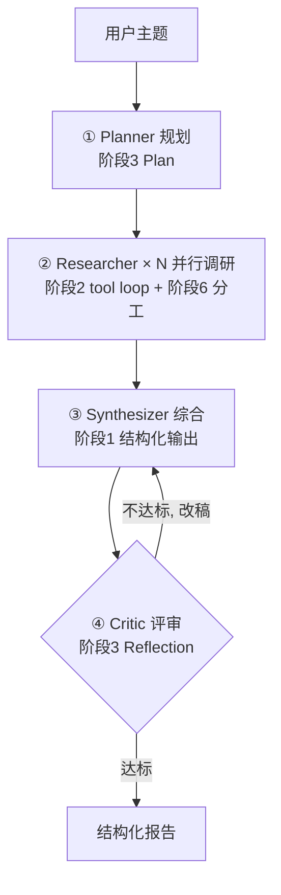
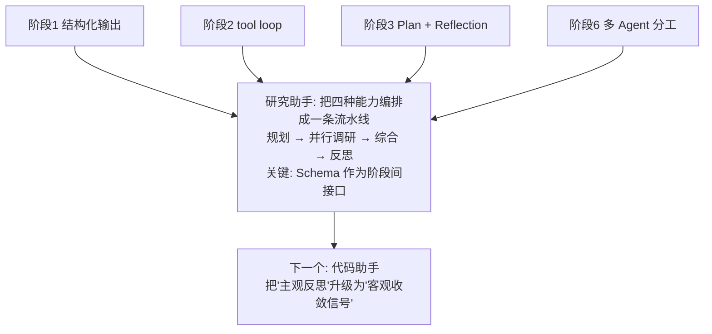

# 项目 A - 研究助手 (Research Agent)

## 学习目标

- 把阶段 1-6 的独立能力，组装成一条**端到端**的研究流水线
- 掌握用 Pydantic 定义"阶段间数据契约"的工程手法
- 理解"规划 → 检索 → 综合 → 反思"这一经典 Agent 应用骨架
- 体会多 Agent 分工在真实项目中的价值

## 运行方式

```bash
python 07_project/research_agent/main.py
```

---

## 核心概念

### 1. 从"零件"到"机器"

前六个阶段我们一直在打磨单项能力。研究助手第一次把它们**串起来**：



每一个方框，都是你在前面阶段已经学过的东西。端到端项目的本质，就是**编排**这些能力。

### 2. Schema 是阶段间的"接口"

多阶段系统最怕的是"上一步的输出下一步解析不了"。研究助手用 `schemas.py` 把每个阶段的产出定义成强类型对象：

| 阶段 | 产出模型 | 作用 |
|------|---------|------|
| 规划 | `ResearchPlan` | 主题 → 一组子问题 |
| 检索 | `Finding` | 子问题 → 带来源的总结 |
| 反思 | `Critique` | 报告 → 打分 + 改进建议 |
| 综合 | `Report` | 发现 → 结构化报告 |

**这就是阶段 1"结构化输出"在真实系统里的价值**：它不是锦上添花，而是多阶段协作的地基。

### 3. 四个专职 Agent

和阶段 6 的 Supervisor 一样，我们让每个 Agent 只做一件事：

- **Planner**：把宽泛主题拆成 3-5 个可独立检索的子问题
- **Researcher**：针对一个子问题，跑一个带搜索工具的 tool loop（阶段 2）
- **Synthesizer**：把所有 Finding 整合成连贯报告
- **Critic**：站在挑剔读者角度打分，驱动改稿

---

## 代码实现详解

### 让 LLM 可靠地输出结构化数据

一个容易踩的坑：直接把 `model_json_schema()` 塞进提示词，有些模型会把 **Schema 本身原样抄回来**。我们改用"填空模板"（`utils/helpers.py` 的 `json_skeleton`）：

```python
def _structured(system, user, model_cls, temperature=0.3):
    skeleton = json_skeleton(model_cls)   # 生成 { "title": <报告标题>, ... } 这样的模板
    full_system = (
        f"{system}\n\n请只输出一个 JSON 对象, 结构严格如下 —— "
        f"把每个 <...> 占位替换成真实内容, 不要输出这段模板说明本身:\n{skeleton}"
    )
    response = client().chat.completions.create(
        model=get_model(),
        messages=[{"role": "system", "content": full_system},
                  {"role": "user", "content": user}],
        response_format={"type": "json_object"},   # 阶段1: 强制 JSON
        temperature=temperature,
    )
    return model_cls.model_validate_json(response.choices[0].message.content)  # pydantic 校验
```

`json_skeleton` 会递归展开嵌套模型和列表，生成一个"填空模板"——这比给 Schema 更能引导模型输出真实实例。

### 研究员：一个带搜索工具的 tool loop

```python
def research_one(sub_question, max_iterations=4):
    messages = [{"role": "system", "content": "你是研究员, 用 web_search 检索..."},
                {"role": "user", "content": f"请调研: {sub_question}"}]
    for _ in range(max_iterations):
        resp = client().chat.completions.create(model=..., messages=messages,
                                                tools=[SEARCH_TOOL])
        msg = resp.choices[0].message
        if not msg.tool_calls:
            break                       # LLM 认为资料够了
        messages.append(msg)
        for tc in msg.tool_calls:       # 执行搜索, 把结果喂回去
            result = execute_tool(tc.function.name, json.loads(tc.function.arguments))
            messages.append({"role": "tool", "tool_call_id": tc.id, "content": result})
    # 最后把整个搜索过程整理成结构化 Finding
    return _structured("整理成客观总结", transcript, Finding)
```

这就是阶段 2 的 tool loop——只不过现在它是更大流水线里的一个"零件"。

### 防御式解析：对 LLM 输出宽进严出

LLM 有时会把来源写成 `{"title": ..., "url": ...}` 而不是纯字符串。与其让整条流水线崩掉，不如在 Schema 里做一次强制转换：

```python
class Finding(BaseModel):
    sources: list[str] = Field(default_factory=list)

    @field_validator("sources", mode="before")
    @classmethod
    def _coerce_sources(cls, v):
        # dict → 取 title/url; 其它 → str()。让格式抖动不至于压垮系统
        return [str(i.get("title") or i.get("url") or i) if isinstance(i, dict) else str(i)
                for i in v] if isinstance(v, list) else v
```

> **端到端系统的一条重要经验**：模型输出天然有抖动，稳健的系统要在边界处做防御，而不是假设模型永远完美。

### 主流程：把四步串起来

```python
def run_research(topic, max_reflections=2):
    plan = make_plan(topic)                              # ① 规划
    findings = [research_one(q) for q in plan.sub_questions]  # ② 逐个调研
    report = synthesize(topic, findings)                 # ③ 综合初版
    for _ in range(max_reflections):                     # ④ 反思循环
        crit = critique(report)
        if crit.passed:
            break
        report = synthesize(topic, findings, critique=crit)  # 带评审意见改稿
    return report.to_markdown()
```

---

## 完整执行流程示例

```
主题: 大语言模型 Agent 的记忆机制有哪些常见实现方式?

① 规划
  拆成 5 个子问题: 短期记忆? 长期记忆? 跨会话记忆? 与注意力结合? 持久化更新?

② 调研 (每个子问题一个研究员, 各自搜索)
  研究员1 → 总结短期记忆方案 (对话窗口 / 滑动窗口 ...)
  研究员2 → 总结长期记忆方案 (向量库检索 ...)
  ...

③ 综合
  初版报告: 标题 + 摘要 + 分章节正文 + 参考来源

④ 反思循环
  第1轮评审: 7/10, 未通过 —— "缺少方案间的对比" → 改稿
  第2轮评审: 8/10, 通过 ✓

→ 输出 Markdown 报告
```

---

## 设计模式深度分析

### 1. 为什么按子问题分而治之？

一次让 LLM "研究整个主题"，它容易泛泛而谈。**先拆成子问题、每个子问题独立调研**，每次 LLM 调用的注意力都更聚焦，检索也更有针对性——这是阶段 3 Plan-and-Execute 的思想在信息检索上的应用。

### 2. 反思循环的"软"信号

研究助手的 Critic 靠 LLM **主观打分**来决定是否继续改稿。这带来一个天然弱点：分数会漂移、可能自我感觉良好。对照下一个项目（代码助手），你会看到"客观信号"的巨大差别。

### 3. 可以并行吗？

示例里研究员是**串行**跑的（便于阅读输出）。因为子问题彼此独立，完全可以用 `asyncio` / 线程并行，把 N 个研究员同时跑起来——这正是阶段 6 多 Agent 的典型优化。

---

## 实践经验

**Q: 搜索没网 / 被限流怎么办？**
A: `web_search` 用 try/except 优雅降级，返回错误提示而非抛异常。流水线仍能跑完，只是报告基于模型已有知识，质量下降。稳健的工具层就该这样"不把上层拖垮"。

**Q: 反思循环会不会无限改稿？**
A: `max_reflections` 是硬上限。加上 Critic 的 `passed` 判断，双重保险防止无限打磨。

**Q: 怎么扩展成"多源检索"？**
A: 在 `tools.py` 再加 `arxiv_search`、`wiki_search` 等工具，研究员的 tool loop 会自动学会按需调用不同来源——工具层和 Agent 逻辑解耦的好处就体现在这里。

---

## 知识脉络



---

## 下一步

→ [项目 B - 代码助手](02_code_agent.md)
