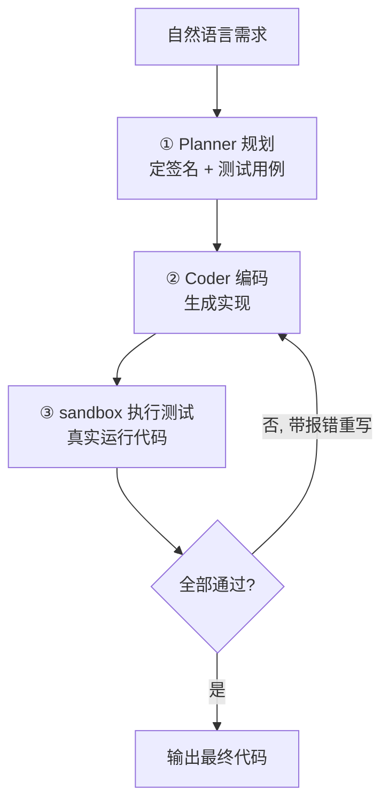
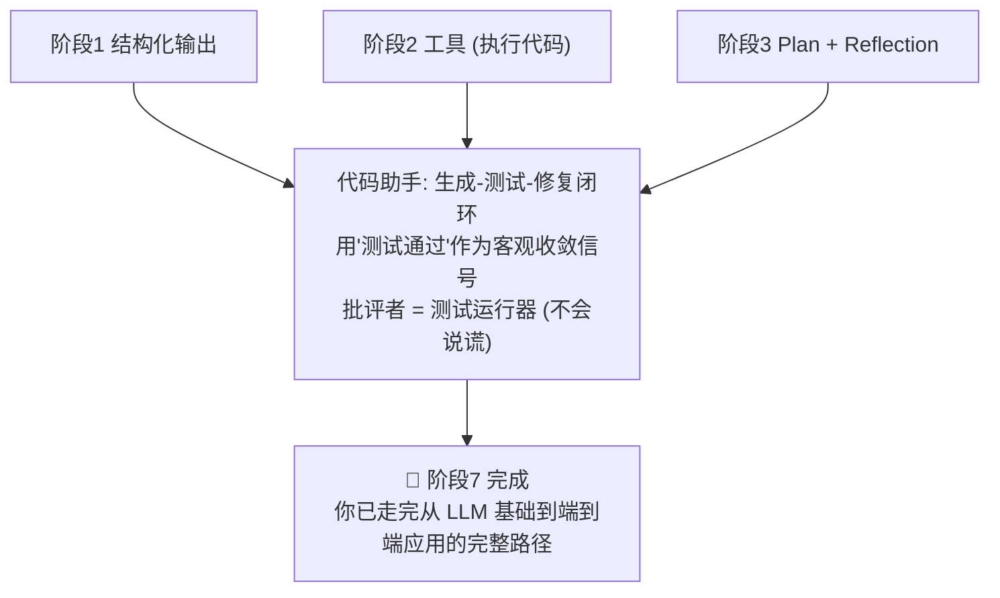

# 项目 B - 代码助手 (Code Agent)

## 学习目标

- 构建一个会**规划、编码、自测、自我修复**的代码 Agent
- 掌握"生成-测试-修复"闭环的实现
- 理解**客观收敛信号**（测试通过）对 Agent 可靠性的决定性作用
- 学会用子进程安全地执行 LLM 生成的代码

## 运行方式

```bash
python 07_project/code_agent/main.py
```

---

## 核心概念

### 1. 一个会自我修复的闭环

代码助手最迷人的地方，是它能**自己发现错误并改正**：



注意这个循环和研究助手的反思循环形状几乎一样，但有一个本质区别——**判断"是否完成"的依据不同**。

### 2. 客观信号 vs 主观信号

| | 研究助手 | 代码助手 |
|--|---------|---------|
| 反思依据 | Critic **主观**打分 | 测试**客观**通过与否 |
| 会不会自我欺骗 | 会（分数漂移） | 不会（测试是事实） |
| 收敛可靠性 | 较弱 | 强 |

> **这是整个阶段 7 最重要的一课**：只要能给 Agent 一个客观、可自动检验的目标，它的可靠性就会质变。代码天然可测试，所以代码助手比研究助手更"靠谱"。

### 3. 先定测试，再写代码

Planner 不直接写代码，而是先产出**函数签名 + 测试用例**（`CodePlan`）。这有两个好处：

- 测试用例就是需求的**可执行规格**——把模糊的自然语言钉成明确契约
- 这些用例成了后面反思循环的**收敛目标**（全绿 = 完成）

这正是"测试驱动开发（TDD）"思想在 Agent 上的体现。

---

## 代码实现详解

### 沙箱：把代码真的跑起来（阶段 2 的"工具"）

对研究助手工具是"搜索"，对代码助手最重要的工具是"执行代码"。用**子进程**做隔离：

```python
def run_tests(code, test_cases, timeout=10) -> TestReport:
    script = _HARNESS.format(user_code=code, tests_json=...)   # 组装：代码 + 测试
    # 写临时文件, 用子进程运行 —— 崩溃/死循环都伤不到主程序
    proc = subprocess.run([sys.executable, tmp_path], capture_output=True,
                          text=True, timeout=timeout)
    if proc.returncode != 0:                    # 语法/运行错误 → 用 stderr 作反馈
        return TestReport(passed=False, ..., details=proc.stderr)
    # 解析 harness 打印的 JSON 结果行
    ...
```

三重安全保障：

| 风险 | 保障 |
|------|------|
| 生成的代码崩溃 | 子进程隔离，主程序不受影响 |
| 死循环 | `timeout` 强制杀掉 |
| 语法错误 | 捕获非零退出码 + stderr |

**关键**：无论哪种失败，都转成 `TestReport` 而不是抛异常——这样反思循环才能"消费"失败信息去修复。

### harness：组装代码与测试

```python
_HARNESS = '''
{user_code}                             # 被测代码

_TESTS = json.loads({tests_json!r})     # 测试用例
_failed = []
for t in _TESTS:
    try:
        actual = eval(t["call"])        # 如 is_prime(4)
        expected = eval(t["expected"])  # 如 False
        if actual != expected:
            _failed.append(...)         # 记录：得到 X, 期望 Y
    except Exception:
        _failed.append(traceback...)    # 运行时异常也记下来
print("__RESULT__" + json.dumps({{"total":..., "failed":..., "details":...}}))
'''
```

失败详情写得越具体（"得到 X，期望 Y"），Coder 修复时就越有的放矢。

### Coder：首轮写码，后续带报错重写（阶段 3 Reflection）

```python
def write_code(plan, last_attempt=None, last_report=None):
    user = f"函数签名: {plan.signature}\n实现思路: {plan.approach}"
    if last_attempt and last_report:            # 反思分支
        user += (f"\n你上一版代码:\n{last_attempt.code}\n"
                 f"测试失败, 报错:\n{last_report.details}\n请分析原因并修正。")
    return _structured(system, user, CodeAttempt)
```

首轮 `last_report` 为空，从零实现；之后每一轮都把**上一版代码 + 真实报错**喂回去，让模型有针对性地改。

### 主循环：生成 → 测试 → 反思

```python
def run_code_agent(requirement, max_fixes=3):
    plan = plan_task(requirement)               # ① 规划
    attempt = report = None
    for round_no in range(1, max_fixes + 2):    # 1 次初版 + max_fixes 次修复
        attempt = write_code(plan, attempt, report)   # ② 编码 / 修复
        report = run_tests(attempt.code, plan.test_cases)  # ③ 执行测试
        if report.passed:                       # 客观收敛信号
            break
    return attempt.code
```

---

## 完整执行流程示例

```
需求: 判断一个整数是否为素数, 注意处理小于 2 的输入

① 规划
  签名: def is_prime(n: int) -> bool
  测试: is_prime(2)==True, is_prime(4)==False, is_prime(1)==False, is_prime(-5)==False ...

② 编码 (初版)
  def is_prime(n):
      for i in range(2, n):        # ← 漏了 n<2 的处理
          if n % i == 0: return False
      return True

③ 执行测试
  ✗ 2/7 失败: is_prime(1) 得到 True, 期望 False

④ 反思修复 (带报错重写)
  def is_prime(n):
      if n < 2: return False       # ← 补上边界处理
      for i in range(2, int(n**0.5)+1):
          if n % i == 0: return False
      return True

③ 再测 → ✓ 7/7 全部通过 → 完成
```

（实际运行中，较强的模型可能一次就写对；构造边界 case 正是为了逼出反思循环。）

---

## 设计模式深度分析

### 1. 为什么反思一定要有"客观信号"？

对比研究助手你会发现：让 LLM 自己判断"够好了没"，它常常过于乐观。而测试通过与否是**不可辩驳的事实**。凡是能把任务目标转成"可自动检验的断言"，就应该这么做——这是把 Agent 从"看起来能用"推向"真的可靠"的关键一步。

### 2. 执行代码的安全边界

本项目用"子进程 + 超时"做教学级隔离，够用但不严格。生产环境执行不可信代码，应上：

- 容器 / gVisor / 微虚机隔离
- 禁网、只读文件系统、资源限额（CPU/内存）
- 白名单式的可导入模块

### 3. 和阶段 3 Reflection 的关系

阶段 3 的 Reflection 是"生成 → 自我批评 → 改进"，批评者也是 LLM。代码助手把**批评者换成了测试运行器**——一个不会说谎的评判员。这就是"外部世界反馈"胜过"自我反思"的典型案例。

---

## 实践经验

**Q: 生成的代码 import 了没装的库怎么办？**
A: 子进程会因 ImportError 非零退出，stderr 作为报错喂回 Coder，它通常会改用标准库或调整思路。

**Q: 如果 max_fixes 用完还没通过？**
A: 输出当前最佳版本并明确提示。实践中可以升级模型、细化测试用例反馈，或把失败用例交给人工。

**Q: 能扩展到多文件 / 真实项目吗？**
A: 可以。把 sandbox 换成"在临时目录里跑 pytest"，把 Coder 换成能写多文件的 Agent，闭环结构不变——这正是真实 AI 编程助手（如本工具）的核心骨架。

**Q: 测试用例是 LLM 生成的，会不会本身就错？**
A: 会，这是该设计的软肋。缓解办法：让用例覆盖明确的边界、允许用户审校用例、或对拿不准的用例做交叉验证。

---

## 知识脉络



---

## 你已完成整个学习路径

从阶段 1 的一次 API 调用，到这里能自我修复的代码 Agent，你已经掌握了 Agent 开发的完整拼图：

| 阶段 | 你获得的能力 |
|------|-------------|
| 1 LLM 基础 | 可靠地和模型对话、拿结构化输出 |
| 2 工具调用 | 让模型通过工具触达外部世界 |
| 3 Agent 模式 | ReAct / Plan / Reflection / 记忆 |
| 4 LangGraph | 用工业级框架构建有状态工作流 |
| 5 MCP | 标准化的工具生态 |
| 6 多 Agent | 分工协作解决复杂任务 |
| 7 端到端项目 | 把一切组装成真实应用 |

**下一步**：动手做一个属于你自己的 Agent 应用——把这两个项目的骨架，套到你真正关心的问题上。
